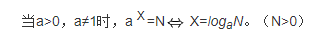

# Data Structure Visualizations
> https://www.cs.usfca.edu/~galles/visualization/Algorithms.html
>
>
>

## 对数
对数函数是指数函数的反函数。

如果ax=N（a>0，且a≠1），那么数x叫做以a为底N的对数，记作x=logaN，读作以a为底N的对数，其中a叫做对数的底数，N叫做真数。

# 时间复杂度和空间复杂度
一般用“大O符号表示法”来表示时间复杂度：T(n) = O(f(n))，n是影响复杂度变化的因子，f(n)是复杂度具体的算法。

## 大O表示法
大O加上（）的形式，里面其实包裹的是一个函数f(),O（f()）,指明某个算法的耗时/耗空间与数据增长量之间的关系。其中的n代表输入数据的量。

常数阶O(1)
> 最低复杂度，常量值，也就是耗时/耗空间与输入数据大小无关，无论输入数据增大多少倍，耗时/耗空间都不变。
>
> 举例：哈希算法就是典型的O(1)时间复杂度，无论数据规模多大，都可以在一次计算后找到目标（不考虑冲突）。

线性阶O(n) 
> 数据量增加几倍，耗时也增加几倍
>
> 举例：遍历算法

对数阶O(logn) 
> 当数据量增加n倍时，耗时增加logn倍，这里log是以2为底的，比如当数据量增加256倍时，耗时只增加8倍。 
>
> 举例：二分查找就是O(logn) 的算法，每次排除一半的数据，所以256个数据中只要查找8次就可以找到目标。

线性对数阶O(nlogN)

平方阶O(n²)
> 把 O(n) 的代码再嵌套循环一遍，它的时间复杂度就是 O(n²) 了。

立方阶O(n³)
> 参考上面的O(n²) 去理解就好了，O(n³)相当于三层n循环，其它的类似。

K次方阶O(n^k)
> 参考上面的O(n²) 去理解就好了，O(n³)相当于三层n循环，其它的类似。

指数阶(2^n)

评价一个算法的效率主要是看它的时间复杂度和空间复杂度情况。可能有的开发者接触时间复杂度和空间复杂度的优化不太多（尤其是客户端），但在服务端的应用是比较广泛的，在巨大并发量的情况下，小部分时间复杂度或空间复杂度上的优化都能带来巨大的性能提升，是非常有必要了解的。
