# 一、源文件编译

## 1、编译

### 1.1）java源文件

```java
package com.coy.test.study.jvm;
public class User {
    private String name;
    private int age;
    private static String address;
    private final static String hobby = "Programming";

    public void say() {
        System.out.println("person say...");
    }

    public int calc(int op1, int op2) {
        return op1 + op2;
    }
}
```

### 1.2）编译

通过命令 `javac` 将 `*.java`  源文件编译为  `*.class` 类文件。

```shell
javac User.java
```

了解 `javac` 编译，对于后面了解类文件结构、类加载机制有一定的帮助，也有利于我们掌握整个Java代码的执行流程。 


## 2、编译流程


### 2.1）词法分析器

将源码转换为Token流。

> 一个字节一个字节的读取源代码，形成规范化的Token流。

 规范化的Token包含： 

> - java关键词：package、import、public、class、int等
> - 自定义单词：包名、类名、变量名、方法名
> - 符号：=、;、+、-、*、/、%、{、}等

### 2.2）语法分析器

将Token流转换为语法树。

> 将一个个Token组成一句句话，或者说成一句句代码快，并检查是否符合Java语言规范。

### 2.3）语义分析器

将语法树转换为注解语法树。

> 将复杂的语法转换为简单的语法，并做一些检查，添加一些代码。
>
> 注解、foeach转换为for循环。

### 2.4）字节码生成器

将注解语法树转换为字节码，并写入 `*.class` 类文件。


## 3、class类文件

> JVM类文件结构官方文档
>
>  https://docs.oracle.com/javase/specs/jvms/se8/html/jvms-4.html#jvms-4.1 

**`*.class` 类文件内容（16进制）：**

```
cafe babe 0000 0034 0027 0a00 0600 1809
0019 001a 0800 1b0a 001c 001d 0700 1e07
001f 0100 046e 616d 6501 0012 4c6a 6176
612f 6c61 6e67 2f53 7472 696e 673b 0100
0361 6765 0100 0149 0100 0761 6464 7265
7373 0100 0568 6f62 6279 0100 0d43 6f6e
... ...
```

### 3.1）魔数 magic

> cafe babe 
>
> 一个标识类文件格式的项。

### 3.2）版本号 minor_version/major_version

> 0000 0034
>
> 对应十进制的52，表示 JDK 8 中的一个版本。

### 3.3）常量池 constant_pool_count

> 0027
>
> 对应十进制的39，代表常量池中有39个常量。

### 3.4）类文件结构 ClassFile Structure

> u4 表示占4个字节，如魔数 cafe babe
>
> u2 表示占2个字节，如minor_version版本号0000 

```
ClassFile {
    u4             magic;			// 魔数
    u2             minor_version;	// JDK最小版本号
    u2             major_version;	// JDK最大版本号
    u2             constant_pool_count;						// 常量池中常量个数
    cp_info        constant_pool[constant_pool_count-1];	// 常量池
    u2             access_flags;		// 访问标志，表示对此类或接口的访问权限和属性
    u2             this_class;			// 类索引，必须是constant_pool的有效索引
    u2             super_class;			// 父类索引，必须是constant_pool的有效索引
    u2             interfaces_count;	// 接口数量，表示此类或接口类型的直接上级接口的数量
    u2             interfaces[interfaces_count];	// 接口索引
    u2             fields_count;					// 字段数量
    field_info     fields[fields_count];			// 字段索引
    u2             methods_count;					// 方法数量
    method_info    methods[methods_count];			// 方法索引
    u2             attributes_count;				// 属性数量
    attribute_info attributes[attributes_count];	// 属性索引
}
```

### 3.5）常量池 Constant Pool

常量池是一个结构表，表示各种字符串常量、类和接口名称、字段名以及类文件结构及其子结构中引用的其他常量。每个constant_pool表项的格式由其第一个“tag”字节表示。

Java虚拟机指令不依赖于类、接口、类实例或数组的运行时布局。相反，指令引用常量池表中的符号信息。

> JVM常量池官方文档：https://docs.oracle.com/javase/specs/jvms/se8/html/jvms-4.html#jvms-4.4 

```
cp_info {
    u1 tag;
    u1 info[];
}
```

| Constant Type 常量类型           | Value 常量值                    | 描述                   |
| -------------------------------- | ------------------------------- | ---------------------- |
| CONSTANT_Utf8_info               | CONSTANT_Utf8(1)                | UTF-8编码的字符串      |
| CONSTANT_Integer_info            | CONSTANT_Integer(3)             | 整型字面量             |
| CONSTANT_Float_info              | CONSTANT_Float(4)               | 浮点数字面量           |
| CONSTANT_Long_info               | CONSTANT_Long(5)                | 长整型字面量           |
| CONSTANT_Double_info             | CONSTANT_Double(6)              | 双精度浮点型字面量     |
| CONSTANT_Class_info              | CONSTANT_Class(7)               | 类或者接口的符号引用   |
| CONSTANT_String_info             | CONSTANT_String(8)              | 字符串类型字面量       |
| CONSTANT_Fieldref_info           | CONSTANT_Fieldref(9)            | 字段的符号引用         |
| CONSTANT_Methodref_info          | CONSTANT_Methodref(10)          | 类中方法的符号引用     |
| CONSTANT_InterfaceMethodref_info | CONSTANT_InterfaceMethodref(11) | 接口中方法的符号引用   |
| CONSTANT_NameAndType_info        | CONSTANT_NameAndType(12)        | 字段或方法的符号引用   |
| CONSTANT_MethodType_info         | CONSTANT_MethodType(16)         | 标志方法类型           |
| CONSTANT_MethodHandle_info       | CONSTANT_MethodHandle(15)       | 表示方法句柄           |
| CONSTANT_InvokeDynamic_info      | CONSTANT_InvokeDynamic(18)      | 表示一个动态方法调用点 |


### 3.6）字段 Fields

每个字段由field_info结构描述。

一个类文件中的两个字段不能具有相同的名称和描述符。

```
field_info {
    u2             access_flags;
    u2             name_index;
    u2             descriptor_index;
    u2             attributes_count;
    attribute_info attributes[attributes_count];
}
```

### 3.7）方法 Methods

每个方法，包括每个实例初始化方法和类或接口初始化方法，都由method_info结构描述。

一个类文件中的两个方法不能具有相同的名称和描述符。

```
method_info {
    u2             access_flags;
    u2             name_index;
    u2             descriptor_index;
    u2             attributes_count;
    attribute_info attributes[attributes_count];
}
```

### 3.8）属性 Attributes

属性用于类文件格式的类文件、字段信息、方法信息和代码属性结构中。

```
attribute_info {
    u2 attribute_name_index;
    u4 attribute_length;
    u1 info[attribute_length];
}
```


## 4、反编译

通过命令 `javap` 来反编译 *.class类文件。

```shell
javap -p -v User.class
```


## 5、字节码分析

> JVM 字节码指令官方文档：https://docs.oracle.com/javase/specs/jvms/se8/html/jvms-3.html#jvms-3.2 
>
> JVM 常量池官方文档： https://docs.oracle.com/javase/specs/jvms/se8/html/jvms-4.html#jvms-4.4 

> **aload_0**: 前缀“a”表示操作码正在操作对象引用。
> **iload_1**:  前缀“i”表示操作码正在操作整数。 

```java
public class com.coy.test.study.jvm.User
  minor version: 0				// JDK 最低版本号
  major version: 52 			// JDK 最高版本号
  flags: ACC_PUBLIC, ACC_SUPER 	// 访问标志
Constant pool: 					// 常量池
   #1 = Methodref          #6.#24         // 方法引用 java/lang/Object."<init>":()V
   #2 = Fieldref           #25.#26        // 字段引用 java/lang/System.out:Ljava/io/PrintStream;
   #3 = String             #27            // 常量引用 person say...
   #4 = Methodref          #28.#29        // 方法引用 java/io/PrintStream.println:(Ljava/lang/String;)V
   #5 = Class              #30            // 类引用 com/coy/test/study/jvm/User
   #6 = Class              #31            // 类引用 java/lang/Object
   #7 = Utf8               name
   #8 = Utf8               Ljava/lang/String;
   #9 = Utf8               age
  #10 = Utf8               I
  #11 = Utf8               address
  #12 = Utf8               hobby
  #13 = Utf8               ConstantValue
  #14 = String             #32            // Programming
  #15 = Utf8               <init>
  #16 = Utf8               ()V
  #17 = Utf8               Code
  #18 = Utf8               LineNumberTable
  #19 = Utf8               say
  #20 = Utf8               calc
  #21 = Utf8               (II)I
  #22 = Utf8               SourceFile
  #23 = Utf8               User.java
  #24 = NameAndType        #15:#16        // "<init>":()V
  #25 = Class              #33            // java/lang/System
  #26 = NameAndType        #34:#35        // out:Ljava/io/PrintStream;
  #27 = Utf8               person say...
  #28 = Class              #36            // java/io/PrintStream
  #29 = NameAndType        #37:#38        // println:(Ljava/lang/String;)V
  #30 = Utf8               com/coy/test/study/jvm/User
  #31 = Utf8               java/lang/Object
  #32 = Utf8               Programming
  #33 = Utf8               java/lang/System
  #34 = Utf8               out
  #35 = Utf8               Ljava/io/PrintStream;
  #36 = Utf8               java/io/PrintStream
  #37 = Utf8               println
  #38 = Utf8               (Ljava/lang/String;)V
{
  // 字段
  private java.lang.String name;
    descriptor: Ljava/lang/String;
    flags: ACC_PRIVATE	// 访问标志：这里表示private字段

  private int age;
    descriptor: I
    flags: ACC_PRIVATE	// 访问标志：这里表示private字段

  private static java.lang.String address;
    descriptor: Ljava/lang/String;
    flags: ACC_PRIVATE, ACC_STATIC	// 访问标志：这里表示私有静态字段

  private static final java.lang.String hobby;
    descriptor: Ljava/lang/String;
    flags: ACC_PRIVATE, ACC_STATIC, ACC_FINAL	// 访问标志：这里表示常量字段
    ConstantValue: String Programming			// 常量值

  // 默认的构造函数
  public com.coy.test.study.jvm.User();
    // 方法描述
    // 括号内表示入参类型。即 无参数
    // 括号外表示返回类型。即 V 表示返回 void 类型
    descriptor: ()V
    flags: ACC_PUBLIC	// 访问标志：这里表示public方法
    Code:
      stack=1, locals=1, args_size=1
         0: aload_0 			// 将this的引用压入[操作数栈]
         1: invokespecial #1    // 调用java/lang/Object."<init>":()V 初始化对象，对应到常量池中的 #1 位置
         4: return				// 执行完以后返回void
      // 指令与代码行数的偏移对应关系
      // 第一个数字对应代码行数，第二个数字对应上面Code中指令前面的数字
      LineNumberTable:
        line 3: 0      // 表示第3行代码，对应的指令为0

  public void say();
    descriptor: ()V		// 表示返回 void 类型
    flags: ACC_PUBLIC	// 访问标志：这里表示public方法
    Code:
      // 操作数栈为2
      // 本地变量数为1
      // 入参个数为1
      stack=2, locals=1, args_size=1
         0: getstatic     #2    // Field java/lang/System.out:Ljava/io/PrintStream;
         3: ldc           #3    // 访问运行时常量池中的值 String person say...
         5: invokevirtual #4    // 执行静态方法 Method java/io/PrintStream.println:(Ljava/lang/String;)V，对应到常量池中的 #4 位置
         8: return				// 执行完以后返回void
      // 行号表，表示代码行号与字节码行号的对应关系
      LineNumberTable:
        line 10: 0      // 表示第10行代码，对应的指令为0
        line 11: 8      // 表示第11行代码，对应的指令为8

  public int calc(int, int);
    // 方法描述
    // 括号内表示入参类型。即 (II) 表示两个 int 类型参数
    // 括号外表示返回类型。即 I 表示返回 int 类型
    descriptor: (II)I
    flags: ACC_PUBLIC	// 访问标志：这里表示public方法
    Code:
      // 操作数栈为2
      // 本地变量数为3
      // 入参个数为3
      stack=2, locals=3, args_size=3
         0: iload_1		// 从[局部变量1]中装载值压入[操作数栈]
         1: iload_2		// 从[局部变量2]中装载值压入[操作数栈]
         2: iadd		// 将[操作数栈]栈顶元素取出，执行int类型的加法，结果压入[操作数栈]
         3: ireturn		// 返回[操作数栈]栈顶元素
      // 行号表，表示代码行号与字节码行号的对应关系
      LineNumberTable:
        line 14: 0      // 表示第14行代码，对应的指令为0
}
SourceFile: "User.java"
```

> - invokespecial指令必须用于调用实例初始化方法。在调用超类（super）中的方法和调用私有方法时也使用它。
>
> - ldc和ldc_w指令用于访问非double和long类型的运行时常量池（包括类字符串的实例）中的值。

从编译结果可以看到类中的属性和方法。


# 二、类加载机制

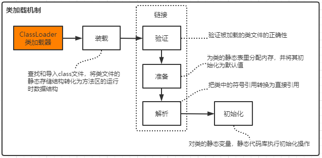

## 1、装载 Load

查找和导入class文件。

> 1）通过一个类的全限定名获取此类文件的二进制字节流。
>
> 2）将这个字节流所代表的静态存储结构转化为方法区的运行时数据结构。
>
> 3）在Java堆中生成一个代表这个类的java.lang.Class对象，作为对方法区中这些数据的访问入口。

## 2、链接 Link

### 2.1）验证 Verify

 验证被加载的类文件的正确性。

> - 文件格式验证
> - 元数据验证
> - 字节码验证
> - 符号引用验证

### 2.2）准备 Prepare

为类的静态表里分配内存，并将其初始化为默认值。

### 2.3）解析 Resolve

把类中的符号引用转换为直接引用。

## 3、初始化 Initialize

对类的静态变量，静态代码库执行初始化操作。


# 三、类加载器


## 1、类加载器类型

1）启动类加载器-Bootstrap ClassLoader

> 负责加载$JAVA_HOME中 jre/lib/rt.jar 里所有的class或Xbootclassoath选项指定的jar包。由C++实现，不是ClassLoader子类。 

2）扩展类加载器-Extension ClassLoader

> 负责加载java平台中扩展功能的一些jar包，包括$JAVA_HOME中jre/lib/ext/*.jar 或 -Djava.ext.dirs指定目录下的jar包。 

3）应用类加载器-App ClassLoader

>  负责加载classpath中指定的jar包及 Djava.class.path 所指定目录下的类和jar包。 

4）自定义类加载器-Custom ClassLoader

> 通过java.lang.ClassLoader的子类自定义加载class，属于应用程序根据自身需要自定义的ClassLoader，如tomcat、jboss都会根据j2ee规范自行实现ClassLoader。


## 2、加载原则

**检查某个类是否已经加载**

顺序是自底向上，从`Custom ClassLoader`到`BootStrap ClassLoader`逐层检 查，如果某个`Classloader`已加载此类，则返回，当所有父类加载器中都没有加载此类时，才由自己加载，保证此类只被加载一次，这就是双亲委派机制。

**双亲委派模型的优势**

Java类随着加载它的类加载器一起具备了一种带有优先级的层次关系。

> 比如，Java中的Object类，它存放在 `rt.jar` 之中,无论哪一个类加载器要加载这个类，最终都是委派给处于模型最顶端的启动类加载器进行加载，因此Object在各种类加载环境中都是同一个类。如果不采用双亲委派模型，那么由各个类加载器自己取加载的话，那么系统中会存在多种不同的Object类。

**双亲委派模型的破坏**

可以继承ClassLoader类，然后重写其中的loadClass方法。


# 四、Java 内存结构

Java虚拟机定义了在程序执行期间使用的各种运行时数据区域。其中一些数据区域是在Java虚拟机启动时创建的，只有在Java虚拟机退出时才会被销毁。其他数据区域是每个线程的。每线程数据区域在创建线程时创建，在线程退出时销毁。

> JVM结构官方文档
>
>  https://docs.oracle.com/javase/specs/jvms/se8/html/jvms-2.html#jvms-2.5.5 

## 1、图解运行时数据区

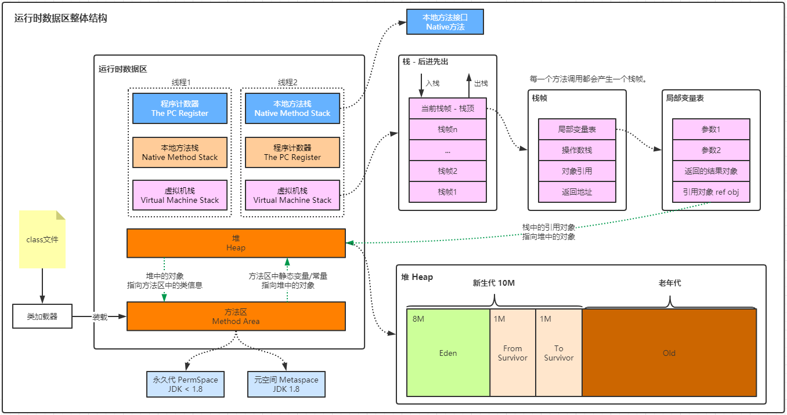

## 2、方法区-Method Area 

方法区是各个线程共享的内存区域，在虚拟机启动时创建。 

用于存储已被虚拟机加载的类信息、常量、静态变量、即时编译器编译后的代码等数据。

> 由`类加载机制`中的`装载`阶段将class文件中的静态结构转换为方法区的运行时数据结构。

### 2.1）永久代/元空间

方法区在JDK8中是Metaspace(元空间)，在JDK6或JDK7中是Perm Space(永久代)。

### 2.2）运行时常量池

 Run-Time Constant Pool

> Class文件中除了有类的版本、字段、方法、接口等描述信息外，还有一项信息就是常量池，用于存放编译时期生成的各种字面量和符号引用，这些内容将在类加载后存放到方法区的运行时常量池中。
>
> 每个运行时常量池都是从Java虚拟机的方法区域分配的。类或接口的运行时常量池是在Java虚拟机创建类或接口时构造的。
>
> 在创建类或接口时，如果构建运行时常量池所需的内存超过了Java虚拟机的方法区域中可用的内存，则Java虚拟机将抛出OutOfMemoryError。


## 3、堆-Heap

Java堆是Java虚拟机所管理内存中最大的一块，在虚拟机启动时创建，被所有线程共享。 

Java对象实例以及数组都在堆上分配。 

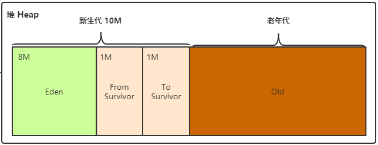

### 3.1、新生代 - Young区

Young区分为Eden区、From区、To区 三个区域，其比例默认为`8:1:1`。

Young区的GC操作，叫做`Minor GC`。

#### 1）伊甸园 - Eden区

一般情况下，新创建的对象都会分配到Eden区，一些特殊的大的对象会直接分配到Old区。

> 比如有A，B，C三个对象创建在Eden区，但是Eden区的内存空间肯定有限，比如有100M，假如已经使用了100M或者达到一个设定的临界值，这时就需要对Eden内存空间进行清理，即垃圾收集(Garbage Collect)， 这样的GC称之为 `Minor GC`，`Minor GC` 指得是Young区的GC。
>
> 经过GC之后，有些对象会被清理掉，有些对象可能还存活着，对于存活着的对象需要将其复制到Survivor区，然后再清空Eden区中的这些对象。每一次复制，对象的年龄会+1，当存活对象的年龄超过15时，会进入到Old区。

#### 2）幸存区 - Survivor区

Survivor区 分为 S0 和 S1 两个区域，也就是From 和 To区。通过参数 –XX:SurvivorRatio 来设定。

**Survivor区主要是为了减少送到老年代的对象，到达减少Full GC的目的。**  

在同一个时间点上，S0和S1只有一个区有数据，另外一个是空的。

> 接着上面的GC来说，比如一开始只有Eden区和From中有对象，To区是空的。 
>
> 此时进行一次GC操作，From区中对象的年龄就会+1，我们知道Eden区中所有存活的对象会被复制到To区，From区中还存活的对象会有两个去处。 
>
> 若对象年龄达到设置的年龄阈值，这类对象会被移动到Old区，而Eden区和From区没有达到阈值的对象会被复制到To区。 此时Eden区和From区已经被清空(被GC的对象已被清理，没有被GC的对象也有各自的去处)。 
>
> 这时From和To交换角色，之前的From变成了To，之前的To变成了From。 也就是说无论如何都要保证名称为To的Survivor区域是空的。 

Minor GC会一直重复这个过程，直到To区被填满，然后会将所有对象复制到老年代中。 

### 3.2、老生代 - Old区

一般情况下，Old区都是年龄比较大的对象，或者相对超过了某个阈值的对象。

Old区的GC的操作，叫做 `Major GC`。

### 3.3、常见问题

#### 1）Minor/Major/Full GC的区别?

> Minor GC: 针对新生代的GC。
>
> Major GC: 针对老年代的GC。
>
> Full GC: 针对新生代+老年代的GC。

#### 2）为什么需要Survivor区?只有Eden区不行吗？

> 如果没有Survivor区，Eden区每进行一次Minor GC，并且没有年龄限制的话，存活的对象就会被送到老年代。 这样一来，老年代很快被填满并触发Major GC(因为Major GC一般伴随着Minor GC,也可以看做触发了Full GC)。 
>
> 老年代的内存空间远大于新生代,进行一次Full GC消耗的时间比Minor GC长得多。 
>
> 执行时间长有什么坏处?频发的Full GC消耗的时间很长,会影响大型程序的执行和响应速度。 
>
> 所以Survivor区存在的意义就是减少被送到老年代的对象，进而减少Full GC的发生，Survivor区的预筛选保证只有经历16次Minor GC还在新生代中存活的对象，才会被移动到老年代。 

#### 3）为什么需要两个Survivor区？

> 解决内存碎片问题。
>
> 有一个Survivor space永远是空的，另一个非空的Survivor space无碎片。

#### 4）为什么Eden:S0:S1是8:1:1？ 

> 1、实际上GC是在新生代内存使用达到**90%**时开始进行的，通过复制回收算法将存活的对象复制到S1区。此时可知道S1区占比10%，也就是说新生代使用内存和S1的比例为9:1。
>
> 2、GC结束后在S1区存活下来的对象，需要放回给S0区，也就是S1和S0对调(名称互换)。既然可以对调，那么可知S1和S0的大小是一样的。由此可得出结论：还有一个占新生代10%空间的S0区域，所以新生代中Eden:S0:S1 = 8:1:1。
>
> 3、GC所清理的90%的新生代内存就是`Eden区`(80%)和`S0区`(10%)


## 4、虚拟机栈-Java Virtual Machine Stack 

虚拟机栈是一个线程执行的区域，保存着一个线程中方法的调用状态，为线程私有。

一个Java线程的运行状态，由一个虚拟机栈来保存，所以虚拟机栈肯定是线程私有的，独有的，随着线程的创建而创建。 每一个被线程执行的方法，为该栈中的栈帧，即每个方法对应一个栈帧。 

每调用一个方法，就会向栈中压入一个栈帧；一个方法调用完成，就会把该栈帧从栈中弹出。

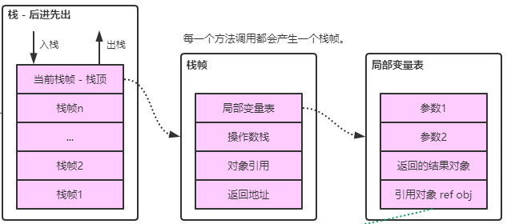

### 4.1、栈帧结构 Frames

每次调用方法时都会创建一个新栈帧。当一个栈帧的方法调用完成时，不管该完成是正常的还是突然的（它抛出一个未捕获的异常），它都会被销毁。帧是从创建帧的线程的Java虚拟机堆栈分配的。每个帧都有自己的局部变量数组、自己的操作数堆栈和对当前方法类的运行时常量池的引用。

一个栈帧需要分配多少内存，不会受到程序运行期变量数据的影响，而仅仅取决于具体的虚拟机实现。 

#### 1）局部变量表 Local variable Table

方法中定义的局部变量以及方法的参数存放在这张表中，局部变量表中的变量不可直接使用，如需要使用的话，必须通过相关指令将其加载至操作数栈中作为操作数使用。

- 在编译程序代码的时候就可以确定栈帧中需要多大的局部变量表，具体大小可在编译后的 Class 文件中看到。 

- 局部变量表的容量以 Variable Slot（变量槽）为最小单位，每个变量槽都可以存储 32 位长度的内存空间。

- 在方法执行时，虚拟机使用局部变量表完成参数值到参数变量列表的传递过程的，如果执行的是实例方法，那局部变量表中第 0 位索引的 Slot 默认是用于传递方法所属对象实例的引用（在方法中可以通过关键字 this 来访问到这个隐含的参数）。 

- 其余参数则按照参数表顺序排列，占用从 1 开始的局部变量 Slot。 

- 基本类型数据以及引用和 returnAddress（返回地址）占用一个变量槽，long 和 double 需要两个。

#### 2）操作数栈 Operand Stacks

- 方法执行的过程中，会有各种字节码指令往操作数栈中写入和提取内容，也就是出栈和入栈操作（与 Java 栈中栈帧操作类似）。 

- 操作栈调用其它有返回结果的方法时，会把结果 push 到栈上（通过操作数栈来进行参数传递）。 

#### 3）动态链接 Dynamic Linking 

- 每个栈帧都包含一个指向运行时常量池中该栈帧所属方法的引用，持有这个引用是为了支持方法调用过程中的动态连接。 

- 在[类加载阶段](https://www.cnblogs.com/jhxxb/p/10900405.html)中的解析阶段会将符号引用转为直接引用，这种转化也称为静态解析。另外的一部分将在运行时转化为直接引用，这部分称为动态链接。

#### 4）返回地址 Return Address

当一个方法开始执行后，只有两种方式可以退出，一种是遇到方法返回的字节码指令；一种是遇见异常，并且这个异常没有在方法体内得到处理。

### 4.2、结合字节码指令理解Java虚拟机栈和栈帧

#### 1）源代码

```java
package com.coy.gupaoedu.study.jvm;

/**
 * 编译：javac StackFrameTest.java
 * 反编译：javap -p -v StackFrameTest.class
 *
 * @author chenck
 * @date 2020/7/30 10:01
 */
public class StackFrameTest {

    public static void main(String[] args) {
        add(5, 7);
    }

    private static int add(int a, int b) {
        int c = 0;
        c = a + b;
        return c;
    }
}
```

#### 2）反编译

反编译后生成字节码。

```shell
javap -p -v StackFrameTest.class
```

#### 3）字节码分析

主要分析 `StackFrameTest.add(int,int)` 方法。下面去掉了不相关的字节码。

> JVM指令可参考官方文档
>
> https://docs.oracle.com/javase/specs/jvms/se8/html/jvms-3.html 

```java
Compiled from "StackFrameTest.java"
public class com.coy.study.jvm.StackFrameTest
  minor version: 0					// JDK 最低版本号
  major version: 52					// JDK 最高版本号
  flags: ACC_PUBLIC, ACC_SUPER		// 访问标志
Constant pool:						// 常量池
  ... ...
  private static int add(int, int);
    // 方法描述
    // 括号内表示入参类型。即 (II) 表示两个 int 类型参数
    // 括号外表示返回类型。即 I 表示返回 int 类型
    descriptor: (II)I
    // 访问标志：这里表示私有静态方法
    flags: ACC_PRIVATE, ACC_STATIC
    // 代码块
    Code:
      // 操作数栈为2
      // 本地变量数为3
      // 入参个数为2
      stack=2, locals=3, args_size=2
         0: iconst_0    // 将int类型常量0压入[操作数栈]
         1: istore_2    // 将[操作数栈]栈顶元素取出，并保存到[局部变量2]
         2: iload_0     // 从[局部变量0]中装载值压入[操作数栈]
         3: iload_1     // 从[局部变量1]中装载值压入[操作数栈]
         4: iadd        // 将[操作数栈]栈顶元素取出，执行int类型的加法，结果压入[操作数栈]
         5: istore_2    // 将[操作数栈]栈顶元素保存到[局部变量2]
         6: iload_2     // 从[局部变量2]中装载值压入[操作数栈]
         7: ireturn     // 返回[操作数栈]栈顶元素
      // 行号表，表示代码行号与字节码行号的对应关系
      LineNumberTable:
        line 17: 0      // 表示第17行代码，对应的指令为0
        line 18: 2      // 表示第18行代码，对应的指令为2
        line 19: 6      // 表示第19行代码，对应的指令为6
}
SourceFile: "StackFrameTest.java"
```

#### 4）方法执行过程中栈帧的变化

分析 `add(5,7)` 的执行过程。最后 `ireturn` 会将操作数栈的栈顶元素返回调用方。

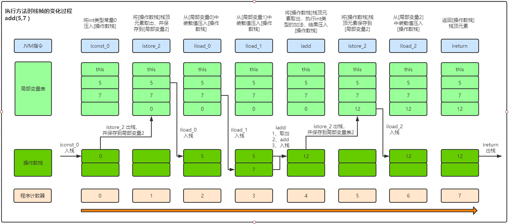


## 5、程序计数器-The PC Register 

程序计数器记录的是正在执行的虚拟机字节码指令的地址，可以认作是当前线程的行号指示器。 为线程私有。

在执行Native方法时程序计数器为空。 

> 程序计数器占用的内存空间很小，由于Java虚拟机的多线程是通过线程轮流切换，并分配处理器执行时间的方式来实现的，在任意时刻，一个处理器只会执行一条线程中的指令。因此，为了线程切换后能够恢复到正确的执行位置，每条线程需要有一个独立的程序计数器(线程私有)。 


## 6、本地方法栈-Native Method Stack 

如果当前线程执行的方法是Native类型的，这些方法就会在本地方法栈中执行，为线程私有。


# 五、垃圾回收 Garbage Collect


## 1、如何确定一个对象是垃圾？

想要进行垃圾回收，得先知道什么样的对象是垃圾。

### 1）引用计数法

通过记录对象被其他对象引用的个数，来判断对象是不是垃圾。

对于某个对象而言，只要应用程序中持有该对象的引用，就说明该对象不是垃圾，如果一个对象没有任
何指针对其引用，它就是垃圾。

**缺点：**如果A和B相互持有引用，则会导致永远不能回收。

### 2）可达性分析

通过GC Root对象，开始向下寻找，看某个对象是否可达，如果可达，则不是垃圾。

**什么样对象可作为 GC Root 的对象呢？**

> 类加载器、Thread、虚拟机栈的本地变量表、static成员、常量引用、本地方法栈的变量等。

## 2、垃圾收集算法

在确定一个对象为垃圾之后，接下来就要考虑垃圾该怎么回收呢？

### 1）标记-清除（Mark-Sweep）

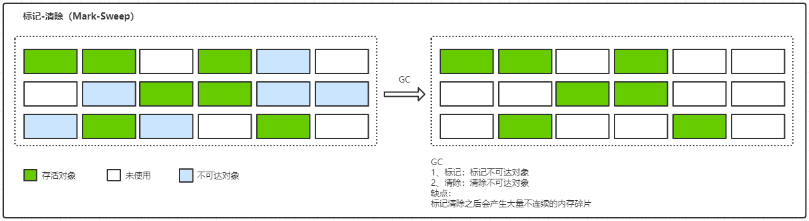

#### 标记

找出内存中需要回收的对象，并把他们标记出来。

> 此时堆中所有的对象都会被扫描一遍，从而才能确定哪些对象需要回收，所以比较耗时。

#### 清除

清除掉被标记为需要回收的对象，释放出对应的内存空间。

#### 缺点

- 标记和清除两个过程都比较耗时，效率不高。
- 标记清除之后会产生大量不连续的内存碎片，空间碎片太多可能会导致以后在程序运行过程中需要分配较大对象时，无法找到足够的连续内存而不得不提前触发另一次垃圾收集动作。

### 2）复制（Copying）

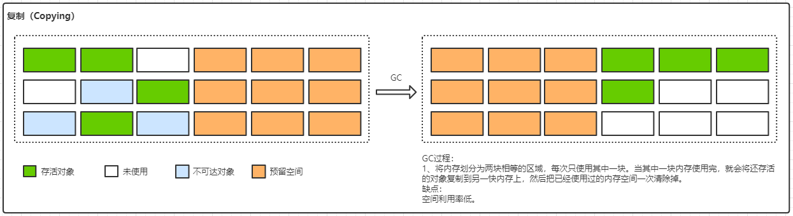

将内存划分为两块相等的区域，每次只使用其中一块。当其中一块内存使用完，就会将还存活的对象复制到另一快内存上，然后把已经使用过的内存空间一次清除掉。

#### 缺点

- 空间利用率低。

### 3）标记-整理（Mark-Compact）

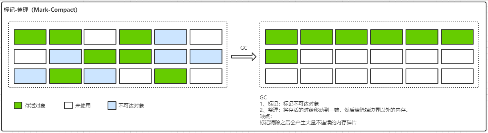

#### 标记

标记过程仍然与"标记-清除"算法一样，但是后续步骤不是直接对可回收对象进行清理，而是将所有存活
的对象都移动到一端，然后直接清理掉端边界以外的内存。

#### 整理

将所有存活的对象都移动到一端，清理掉边界以外的内存。

#### 缺点

## 3、分代收集算法

堆内存到底使用的是哪一种垃圾收集算法呢？

**Young区**

采用复制算法。对象在被分配之后，可能生命周期比较短，Young区复制效率比较高，比如S0和S1采用的就是复制算法。

**Old区**

采用标记清除或标记整理。Old区对象存活时间比较长，复制来复制去没必要，不如做个标记再清理。


## 4、垃圾收集器

收集算法是内存回收的方法论，垃圾收集器是内存回收的具体实现。其中主要的垃圾收集器为CMS和G1。

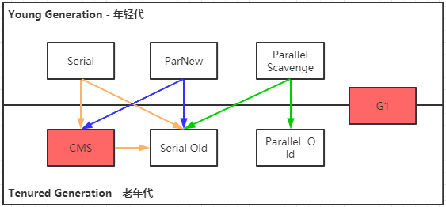

### 1）垃圾收集器类型

#### 1.1）串行收集器

`Serial` 和 `Serial Old`，只有一个垃圾收集线程(GC线程)执行，会停顿用户线程。

> 适用于内存比较小的嵌入式设备。

#### 1.2）并行收集器（吞吐量优先）

`Parallel Scavenge` 和 `Parallel Old`，多个垃圾收集线程(GC线程)并行工作，会停顿用户线程。

> 适用于科学计算	、后台处理等场景。

#### 1.3）并发收集器（停顿时间优先）

`CMS` 和 `G1`，用户线程和垃圾收集线程(GC线程)同时执行（不一定是并行的，也可能是交替执行），垃圾收集线程(GC线程)执行时不会停顿用户线程的运行。

> 适用于对时间有要求的场景，如web。

#### 1.4）停顿时间和吞吐量

这两个指标是评价垃圾回收器好坏的标准，其实调优也就是在观察者两个变量。

- 停顿时间

垃圾收集器执行垃圾回收时造成的系统停顿时间，也就是Stop The World的时间。

> 停顿时间越短就越适合需要和用户交互的程序，良好的响应速度能提升用户体验。

- 吞吐量

吞吐量 = 运行用户代码时间 / (运行用户代码时间 + 垃圾收集时间)

> 高吞吐量可以高效地利用CPU时间，尽快完成程序的运算任务，所以适用于后台运算等场景。
>
> 比如虚拟机总共运行了100分钟，垃圾收集时间用了1分钟，吞吐量=(100-1)/100=99%。
>
> 若吞吐量越大，意味着垃圾收集的时间越短，则用户代码可以充分利用CPU资源，尽快完成程序
> 的运算任务。


### 2）Serial 收集器

Serial收集器是最基本、发展历史最悠久的收集器，在JDK1.3.1之前是虚拟机新生代收集的唯一选择。

它是一种单线程收集器，也就是说它只会使用一个CPU的一个GC收集线程去完成垃圾收集工作，并且在执行垃圾收集工作时会暂停所有的用户线程。

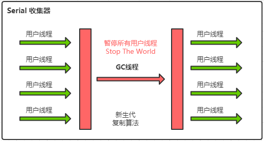


优点：简单高效，拥有很高的单线程收集效率
缺点：收集过程需要暂停所有线程
算法：复制算法
适用范围：新生代
应用：Client模式下的默认新生代收集器。

### 3）ParNew 收集器

ParNew 收集器可以理解为Serial 收集器的多线程版本。

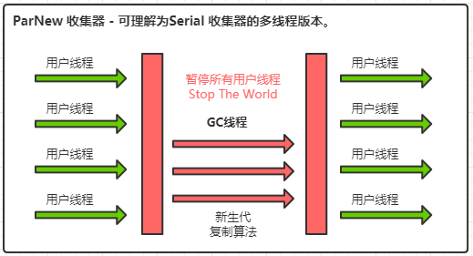


优点：在多CPU时，比Serial收集器效率高。
缺点：收集过程暂停所有应用程序线程，单CPU时比Serial效率差。
算法：复制算法
适用范围：新生代
应用：运行在Server模式下的虚拟机中首选的新生代收集器。

### 4）Parallel Scavenge 收集器

Parallel Scavenge收集器是一个新生代收集器，它使用复制算法的收集器，又是并行的多线程收集器，看上去和ParNew一样，但是Parallel Scanvenge更关注 系统的吞吐量 。

```
-XX:MaxGCPauseMillis // 控制最大的垃圾收集停顿时间
-XX:GCTimeRatio      // 设置吞吐量的大小(0,100)
```


### 5）Serial Old 收集器

Serial Old 收集器是Serial 收集器的老年代版本，也是一个单线程收集器，不同的是采用"标记-整理算
法"，运行过程和Serial 收集器一样。

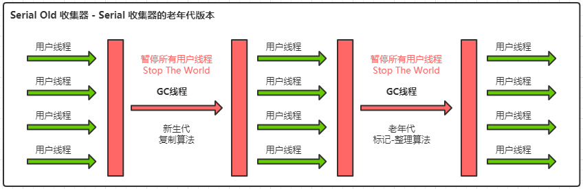


### 6）Parallel Old 收集器

Parallel Old收集器是Parallel Scavenge收集器的老年代版本，使用多线程和"标记-整理算法"进行垃圾
回收。吞吐量优先。


### 7）CMS 收集器

Concurrent Mark Sweep 并发标记收集器。JDK 8默认的收集器。

CMS 收集器的目标是`降低停顿时间`。采用`标记-清除算法` 。

> 官网文档：
>
> https://docs.oracle.com/javase/8/docs/technotes/guides/vm/gctuning/cms.html#concurrent_mark_sweep_cms_collector

#### 7.1）优点

> 并发收集、低停顿

#### 7.2）缺点

> 产生大量空间碎片、并发阶段会降低吞吐量。
>
> 占用CPU资源。
>
> 无法处理并发清除阶段产生的浮动垃圾（下一次GC清除）。


#### 7.3）回收过程

**并发标记和并发清除，GC线程可以与用户线程一起工作，所以CMS收集器的内存回收过程是与用户线程一起并发地执行的。**

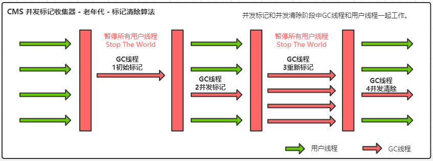

- 1、初始标记

> CMS initial mark，标记GC Roots能关联到的对象。
>
> 会Stop The World，也就是暂停用户线程。

- 2、并发标记

> CMS concurrent mark，进行GC Roots Tracing，基于GC Roots对象开始往下一层一层进行对象可达性分析。GC线程和用户线程并发执行。

- 3、重新标记

> CMS remark， 修正在并发标记阶段因为用户线程的并发执行导致变动的数据。
>
> 会Stop The World，也就是暂停用户线程。

- 4、并发清除

> CMS concurrent sweep，清除不可达的GC Roots对象。GC线程和用户线程并发执行。


### 8）G1 收集器

从JDK 7开始使用，到JDK 8已非常成熟，JDK 9默认的垃圾收集器，适用于新老生代。

G1 收集器的目标是`降低停顿时间`。采用`标记-整理算法`。

> 官方文档
>
> https://docs.oracle.com/javase/8/docs/technotes/guides/vm/gctuning/g1_gc.html#garbage_first_garbage_collection

#### 8.1）优点

> 1、并行与并发
>
> 2、分代收集（仍然保留了分代的概念）
>
> 3、空间整合（整体上属于“标记-整理”算法，不会导致空间碎片）
>
> 4、可预测的停顿（比CMS更先进的地方在于能让使用者明确指定一个长度为M毫秒的时间片段内，消耗在垃圾收集上的时间不得超过N毫秒）

#### 8.2）回收过程

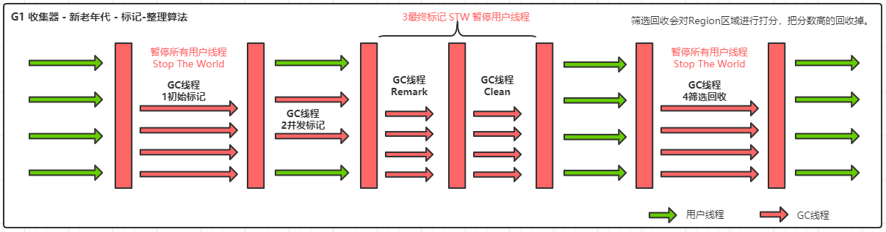

- 1、初始标记

> Initial Marking，标记GC Roots能关联到的对象，修改TAMS的值。
>
> 会Stop The World，也就是暂停用户线程。

- 2、并发标记

> Concurrent Marking，进行GC Roots Tracing，基于GC Roots对象开始往下一层一层进行对象可达性分析。GC线程和用户线程并发执行。

- 3、最终标记

> Final Marking，修正在并发标记阶段因为用户线程的并发执行导致变动的数据。
>
> 会Stop The World，也就是暂停用户线程。

- 4、筛选回收

> Live Data Counting and Evacuation，对各个Region的回收价值和成本进行排序，根据用户所期望的GC停顿时间制定回收计划。

#### 8.3）G1内存模型

使用G1收集器时，Java堆的内存布局与其他收集器有很大差别，它将整个Java堆划分为多个大小相等的独立区域（Region），虽然还保留有新生代和老年代的概念，但新生代和老年代不再是物理隔离的了，它们都是Region集合的一部分（不需要连续）。

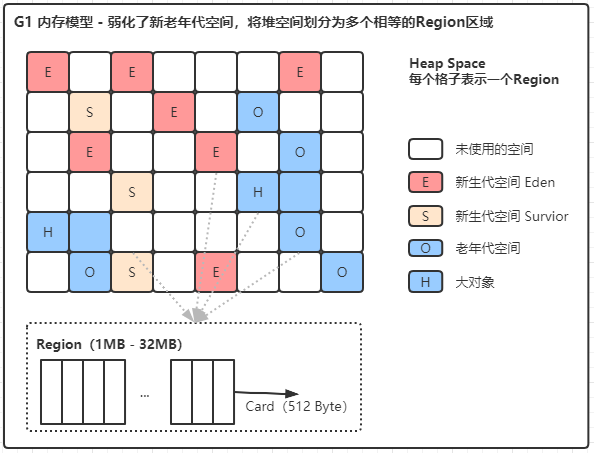


#### 8.4）G1分区模型

使用一个Per Region Table（PRT）来记录Region之间的引用，Card之间的引用，对象之间的引用， 以便GC线程根据GCRoot进行可达性分析。 GC 调优时会用到这个知识点。

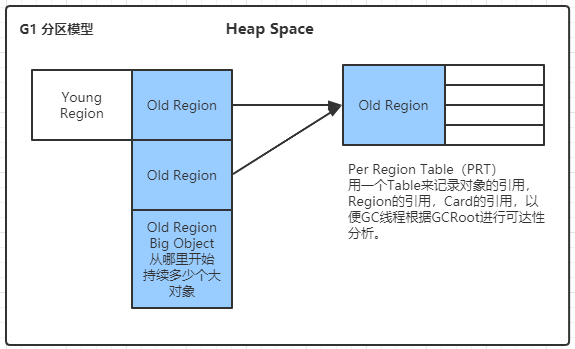


#### 8.5）收集集合 CSet

代表每次GC暂停时回收的一些列目标Region分区。

#### 8.6）判断是否需要使用G1收集器？

- 1、50%以上的堆被存活对象占用
- 2、对象分配和晋升的速度变化非常大
- 3、垃圾回收时间比较长


### 9、如何选择垃圾收集器

> 官方文档：
>
> https://docs.oracle.com/javase/8/docs/technotes/guides/vm/gctuning/collectors.html#sthref28

- 优先调整堆的大小让服务器自己来选择
- 如果内存小于100M，使用串行收集器
- 如果是单核，并且没有停顿时间要求，使用串行或JVM自己选
- 如果允许停顿时间超过1秒，选择并行或JVM自己选
- 如果响应时间最重要，并且不能超过1秒，使用并发收集器


### 10、如何设置垃圾收集器

**1）串行**

> -XX:+UseSerialGC
> -XX:+UseSerialOldGC

**2）并行(吞吐量优先)**

>  -XX:+UseParallelGC
>  -XX:+UseParallelOldGC

**3）并发收集器(停顿时间优先)**

> -XX:+UseConcMarkSweepGC
> -XX:+UseG1GC


# 六、JVM 实战

## 1、常用命令

### 1）jps

```shell
# 查看java进程（显示主类全名）
jps -l
# 查看java进程（运行传入主类的参数）
jps -m
# 查看java进程（显示JVM参数）
jps -v
```

### 2）jstat

查看JVM统计信息，查看类加载、内存、垃圾收集、JIT编译信息。

> 官方文档
>
> https://docs.oracle.com/javase/8/docs/technotes/tools/unix/jstat.html

```shell
# 查看options参数的帮助
jstat -options -help
# 每1秒打印一次GC信息
jstat -gcutil 16876 1000
# 每1秒打印一次GC信息，共打印10次
jstat -gcutil 16876 1000 10
# 查看垃圾收集信息
jstat -gc 16876 1000 10
# 查看类装载信息
jstat -class 16876 1000
```

```
# 每1秒打印一次GC信息
jstat -gcutil 16876 1000
-------------------------
S0     S1     E      O      M     CCS    YGC     YGCT    FGC    FGCT     GCT
0.00  99.56  52.16  18.72  81.15  84.83      1    0.005     0    0.000    0.005
0.00  99.56  52.16  18.72  81.15  84.83      1    0.005     0    0.000    0.005
... ...
0.00   0.00  36.73  72.19  81.16  84.83      3    0.017     1    0.119    0.135
0.00   0.00  36.73  72.19  81.16  84.83      3    0.017     1    0.119    0.135
-------------------------
S0：表示Survior的from区
S1：表示Survior的to区
E： 表示Eden区
O： 表示Old区
M： 表示Metaspace
CCS：
YGC：  表示Young GC次数
YGCT： 表示Young GC时间，单位秒
FGC：  表示Full GC次数
FGCT： 表示Full GC时间，单位秒
GCT：  表示Young GC和Full GC的总时间
```


```
# 查看垃圾收集信息
jstat -gc 16876 1000 10
-------------------------
 S0C    S1C    S0U    S1U      EC       EU        OC         OU       MC     MU    CCSC   CCSU   YGC     YGCT    FGC    FGCT     GCT
1536.0 1536.0  0.0    0.0   10240.0   4204.4   27648.0      0.0     4480.0 775.1  384.0   76.4       0    0.000   0      0.000    0.000
1536.0 1536.0  0.0    0.0   10240.0   4541.0   27648.0      0.0     4480.0 775.1  384.0   76.4       0    0.000   0      0.000    0.000
1536.0 1536.0  0.0    0.0   10240.0   4541.0   27648.0      0.0     4480.0 775.1  384.0   76.4       0    0.000   0      0.000    0.000
-------------------------
S0C：年轻代中 To Survivor 的容量（单位 KB）；
S1C：年轻代中 From Survivor 的容量（单位 KB）；
S0U：年轻代中 To Survivor 目前已使用空间（单位 KB）；
S1U：年轻代中 From Survivor 目前已使用空间（单位 KB）；
EC： 年轻代中 Eden 的容量（单位 KB）；
EU： 年轻代中 Eden 目前已使用空间（单位 KB）；
OC： 老年代的容量（单位 KB）；
OU： 老年代目前已使用空间（单位 KB）；
MC： 元空间的容量（单位 KB）；
MU： 元空间目前已使用空间（单位 KB）；
YGC： 从应用程序启动到采样时年轻代中 gc 次数；
YGCT：从应用程序启动到采样时年轻代中 gc 所用时间 (s)；
FGC： 从应用程序启动到采样时 老年代（Full Gc）gc 次数；
FGCT：从应用程序启动到采样时 老年代代（Full Gc）gc 所用时间 (s)；
GCT： 从应用程序启动到采样时 gc 用的总时间 (s)。
```


### 3）jinfo

实时调整和查看JVM参数。

jinfo -XX:option=value

```shell
# 查看java进程信息(含JVM、系统环境变量等信息)
jinfo 16876
# 查看JVM的flag信息
jinfo -flags 16876
# 查看指定名称的flag信息
jinfo -flag UseG1GC 16876
# 启用或禁用指定名称的JVM标志，只有被标记为manageable的flags可以被实时修改
jinfo -flag [+|-]name PID
# 设置指定flag名称的值
jinfo -flag name=value PID
```

### 4）jmap

```shell
# 查看堆内存相关信息
jmap -heap PID
# 转储堆栈信息到文件
jmap -dump:format=b,file=filepath PID
# 查看存活对象
jmap -histo:live PID
```


### 5）jstack

查看线程堆栈信息，可用于分析死锁的情况。

```shell
jstack PID
```


## 2、常用工具

### 1）jconsole

jconsole工具是JDK自带的可视化监控工具。

查看java应用程序的运行概况、监控堆信息、永久区使用情况、类加载情况等。

```shell
# 启用jconsole，在命令行中输入
jconsole
```

### 2）jvisualvm

可以在[工具 - 插件 - 可用插件]中选择`Visual GC`插件来查看堆内存的运行情况。

**监控本地JVM进程**

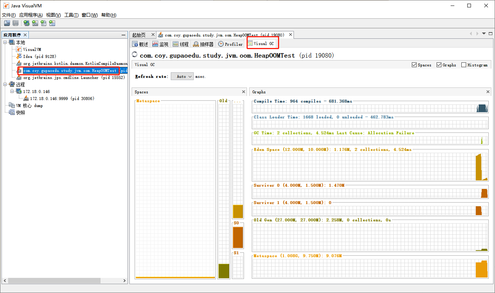

**监控远程JVM进程**

可添加JMX连接，不过需要远程应用开启JMX功能。

- 添加JMX启动参数

```
-Dcom.sun.management.jmxremote -
Djava.rmi.server.hostname=127.0.0.1 -Dcom.sun.management.jmxremote.port=8998
-Dcom.sun.management.jmxremote.ssl=false -
Dcom.sun.management.jmxremote.authenticate=true -
Dcom.sun.management.jmxremote.access.file=../conf/jmxremote.access -
Dcom.sun.management.jmxremote.password.file=../conf/jmxremote.password
```

- 在 ../conf 中添加两个文件`jmxremote.access`和`jmxremote.password`

jmxremote.access 访问权限文件

```
guest readonly
manager readwrite
```

jmxremote.password 账号文件

```
guest guest
manager manager
```

```shell
# 得到PID
lsof -i:8998
# 查看8998监听情况
netstat -antup | grep PID
```

### 3）Arthas

Arthas 是Alibaba开源的Java诊断工具，采用命令行交互模式，是排查jvm相关问题的利器。

> 官网：https://github.com/alibaba/arthas


### 4）MAT


### 5）GC 日志分析工具

1、在线工具

2、GCViewer

## 3、常见Java性能问题

上面列举了常用的工具和命令，下面将结合模拟环境的案例来分析具体的问题。

当然真实的线上环境可能十分复杂，并没有模拟环境那么简单，但原理是一样的，问题的表现也是类似的，我们重点是要抓住原理，灵活运用，来解决复杂的线上问题。

### 1）CPU负载过高

### 2）内存泄漏

2.1）内存泄漏和内存溢出的区别？

> 内存泄漏：对象无法得到及时的回收，持续占用内存空间，从而造成内存空间的浪费。
>
> 内存溢出：内存泄漏到一定的程度就会导致内存溢出，但是内存溢出也有可能是大对象导致的。

2.2）

2.3）

### 3）死锁

### 4）GC频繁

### 5）线程频繁切换