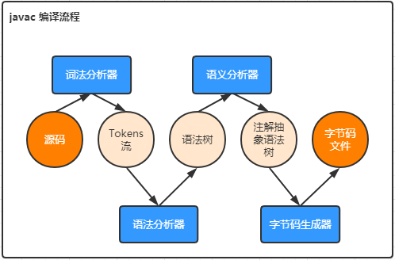
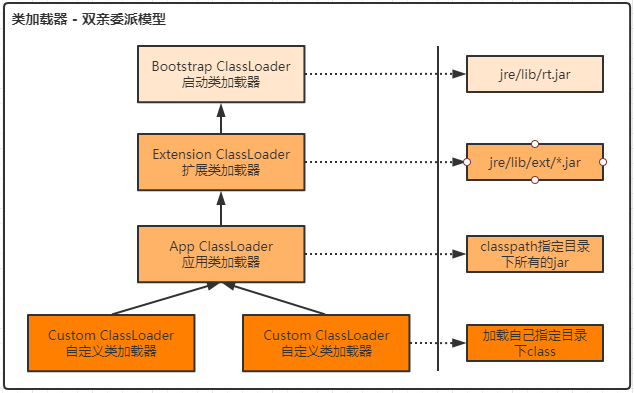
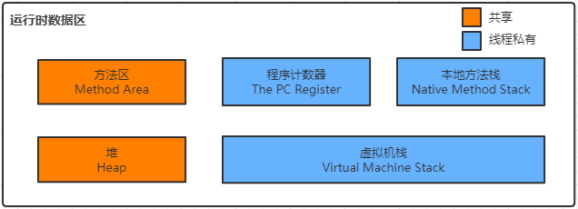

# 一、源文件编译

## 1、编译

### 1）java源文件

```java
package com.coy.test.study.jvm;
public class User {
    private String name;
    private int age;
    private static String address;
    private final static String hobby = "Programming";

    public void say() {
        System.out.println("person say...");
    }

    public int calc(int op1, int op2) {
        return op1 + op2;
    }
}
```

### 2）编译

通过命令 `javac` 将 `*.java`  源文件编译为  `*.class` 类文件。

```shell
javac User.java
```

了解 `javac` 编译，对于后面了解类文件结构、类加载机制有一定的帮助，也有利于我们掌握整个Java代码的执行流程。 

## 2、编译流程



**词法分析器**

将源码转换为Token流。

> 一个字节一个字节的读取源代码，形成规范化的Token流。

 规范化的Token包含： 

> - java关键词：package、import、public、class、int等
> - 自定义单词：包名、类名、变量名、方法名
> - 符号：=、;、+、-、*、/、%、{、}等

**语法分析器**

将Token流转换为语法树。

> 将一个个Token组成一句句话，或者说成一句句代码快，并检查是否符合Java语言规范。

**语义分析器**

将语法树转换为注解语法树。

> 将复杂的语法转换为简单的语法，并做一些检查，添加一些代码。
>
> 注解、foeach转换为for循环。

**字节码生成器**

将注解语法树转换为字节码，并写入 `*.class` 类文件。

## 3、class类文件

**`*.class` 类文件内容（16进制）：**

```
cafe babe 0000 0034 0027 0a00 0600 1809
0019 001a 0800 1b0a 001c 001d 0700 1e07
001f 0100 046e 616d 6501 0012 4c6a 6176
612f 6c61 6e67 2f53 7472 696e 673b 0100
0361 6765 0100 0149 0100 0761 6464 7265
7373 0100 0568 6f62 6279 0100 0d43 6f6e
... ...
```

**魔数 magic**

> cafe babe 
>
> 一个标识类文件格式的项。

**版本号 minor_version/major_version** 

> 0000 0034
>
> 对应十进制的52，表示 JDK 8 中的一个版本。

**常量池 constant_pool_count**

> 0027
>
> 对应十进制的39，代表常量池中有39个常量。


## 4、反编译

既然有编译，那么对应的肯定要有反编译。通过命令 `javap` 来反编译 *.class类文件。

> aload_0: 前缀“a”表示操作码正在操作对象引用。
> iload_1:  前缀“i”表示操作码正在操作整数。 

```shell
javap -p -v User.class
```

```java
public class com.coy.test.study.jvm.User
  minor version: 0
  major version: 52 // 版本号
  flags: ACC_PUBLIC, ACC_SUPER // 访问标志
Constant pool: // 常量池
   #1 = Methodref          #6.#24         // java/lang/Object."<init>":()V
   #2 = Fieldref           #25.#26        // java/lang/System.out:Ljava/io/PrintStream;
   #3 = String             #27            // person say...
   #4 = Methodref          #28.#29        // java/io/PrintStream.println:(Ljava/lang/String;)V
   #5 = Class              #30            // com/coy/gupaoedu/study/jvm/User
   #6 = Class              #31            // java/lang/Object
   #7 = Utf8               name
   #8 = Utf8               Ljava/lang/String;
   #9 = Utf8               age
  #10 = Utf8               I
  #11 = Utf8               address
  #12 = Utf8               hobby
  #13 = Utf8               ConstantValue
  #14 = String             #32            // Programming
  #15 = Utf8               <init>
  #16 = Utf8               ()V
  #17 = Utf8               Code
  #18 = Utf8               LineNumberTable
  #19 = Utf8               say
  #20 = Utf8               calc
  #21 = Utf8               (II)I
  #22 = Utf8               SourceFile
  #23 = Utf8               User.java
  #24 = NameAndType        #15:#16        // "<init>":()V
  #25 = Class              #33            // java/lang/System
  #26 = NameAndType        #34:#35        // out:Ljava/io/PrintStream;
  #27 = Utf8               person say...
  #28 = Class              #36            // java/io/PrintStream
  #29 = NameAndType        #37:#38        // println:(Ljava/lang/String;)V
  #30 = Utf8               com/coy/test/study/jvm/User
  #31 = Utf8               java/lang/Object
  #32 = Utf8               Programming
  #33 = Utf8               java/lang/System
  #34 = Utf8               out
  #35 = Utf8               Ljava/io/PrintStream;
  #36 = Utf8               java/io/PrintStream
  #37 = Utf8               println
  #38 = Utf8               (Ljava/lang/String;)V
{
  // 字段
  private java.lang.String name;
    descriptor: Ljava/lang/String;
    flags: ACC_PRIVATE

  private int age;
    descriptor: I
    flags: ACC_PRIVATE

  private static java.lang.String address;
    descriptor: Ljava/lang/String;
    flags: ACC_PRIVATE, ACC_STATIC

  private static final java.lang.String hobby;
    descriptor: Ljava/lang/String;
    flags: ACC_PRIVATE, ACC_STATIC, ACC_FINAL
    ConstantValue: String Programming

  // 默认的构造函数
  public com.coy.gupaoedu.study.jvm.User();
    descriptor: ()V
    flags: ACC_PUBLIC
    Code:
      stack=1, locals=1, args_size=1
         // 将this的引用压入栈
         0: aload_0 
         // 出栈，调用java/lang/Object."<init>":()V初始化对象，就是调用this的init()方法
         1: invokespecial #1    // Method java/lang/Object."<init>":()V
         4: return
      // 指令与代码行数的偏移对应关系,第一个数字对应代码行数，第二个数字对应上面Code中指令前面的数字
      LineNumberTable:
        line 3: 0

  public void say();
    descriptor: ()V
    flags: ACC_PUBLIC
    Code:
      stack=2, locals=1, args_size=1
         0: getstatic     #2                  // Field java/lang/System.out:Ljava/io/PrintStream;
         3: ldc           #3                  // String person say...
         5: invokevirtual #4                  // Method java/io/PrintStream.println:(Ljava/lang/String;)V
         8: return
      LineNumberTable:
        line 10: 0
        line 11: 8

  public int calc(int, int);
    descriptor: (II)I
    flags: ACC_PUBLIC
    Code:
      stack=2, locals=3, args_size=3
         // 将变量1的值放入栈顶
         0: iload_1
		 // 将变量2的值放入栈顶
         1: iload_2
         // 将变量1和变量2相加，结果入栈
         2: iadd
         3: ireturn
      LineNumberTable:
        line 14: 0
}
SourceFile: "User.java"
```

从编译结果可以看到类中的属性和方法。

# 二、类加载机制


## 1、装载 Load

查找和导入class文件。

> 1）通过一个类的全限定名获取此类文件的二进制字节流。
>
> 2）将这个字节流所代表的静态存储结构转化为方法区的运行时数据结构。
>
> 3）在Java堆中生成一个代表这个类的java.lang.Class对象，作为对方法区中这些数据的访问入口。

## 2、链接 Link

### 2.1）验证 Verify

 验证被加载的类文件的正确性。

> - 文件格式验证
> - 元数据验证
> - 字节码验证
> - 符号引用验证

### 2.2）准备 Prepare

为类的静态表里分配内存，并将其初始化为默认值。

### 2.3）解析 Resolve

把类中的符号引用转换为直接引用。

## 3、初始化 Initialize

对类的静态变量，静态代码库执行初始化操作。


# 三、类加载器



## 1、类加载器类型

1）启动类加载器-Bootstrap ClassLoader

> 负责加载$JAVA_HOME中 jre/lib/rt.jar 里所有的class或Xbootclassoath选项指定的jar包。由C++实现，不是ClassLoader子类。 

2）扩展类加载器-Extension ClassLoader

> 负责加载java平台中扩展功能的一些jar包，包括$JAVA_HOME中jre/lib/ext/*.jar 或 -Djava.ext.dirs指定目录下的jar包。 

3）应用类加载器-App ClassLoader

>  负责加载classpath中指定的jar包及 Djava.class.path 所指定目录下的类和jar包。 

4）自定义类加载器-Custom ClassLoader

> 通过java.lang.ClassLoader的子类自定义加载class，属于应用程序根据自身需要自定义的ClassLoader，如tomcat、jboss都会根据j2ee规范自行实现ClassLoader。


## 2、加载原则

**检查某个类是否已经加载**

顺序是自底向上，从`Custom ClassLoader`到`BootStrap ClassLoader`逐层检 查，如果某个`Classloader`已加载此类，则返回，当所有父类加载器中都没有加载此类时，才由自己加载，保证此类只被加载一次，这就是双亲委派机制。

**双亲委派模型的优势**

Java类随着加载它的类加载器一起具备了一种带有优先级的层次关系。

> 比如，Java中的Object类，它存放在 `rt.jar` 之中,无论哪一个类加载器要加载这个类，最终都是委派给处于模型最顶端的启动类加载器进行加载，因此Object在各种类加载环境中都是同一个类。如果不采用双亲委派模型，那么由各个类加载器自己取加载的话，那么系统中会存在多种不同的Object类。

**双亲委派模型的破坏**

可以继承ClassLoader类，然后重写其中的loadClass方法。


# 四、运行时数据区



## 1、方法区-Method Area 

方法区是各个线程共享的内存区域，在虚拟机启动时创建。 

用于存储已被虚拟机加载的类信息、常量、静态变量、即时编译器编译后的代码等数据。

> 由`类加载机制`中的`装载`阶段将class文件中的静态结构转换为方法区的运行时数据结构。

**注意**

1）方法区在JDK8中是Metaspace(元空间)，在JDK6或JDK7中是Perm Space(永久代)。

2）运行时常量池 - Run-Time Constant Pool

> Class文件中除了有类的版本、字段、方法、接口等描述信息外，还有一项信息就是常量池，用于存放编译时期生成的各种字面量和符号引用，这些内容将在类加载后存放到方法区的运行时常量池中。

## 2、堆-Heap

Java堆是Java虚拟机所管理内存中最大的一块，在虚拟机启动时创建，被所有线程共享。 

Java对象实例以及数组都在堆上分配。 

## 3、虚拟机栈-Java Virtual Machine Stack 

虚拟机栈是一个线程执行的区域，保存着一个线程中方法的调用状态，为线程私有。

一个Java线程的运行状态，由一个虚拟机栈来保存，所以虚拟机栈肯定是线程私有的，独有的，随着线程的创建而创建。 每一个被线程执行的方法，为该栈中的栈帧，即每个方法对应一个栈帧。 


## 4、程序计数器-The PC Register 

程序计数器记录的是正在执行的虚拟机字节码指令的地址，为线程私有。

在执行Native方法时程序计数器为空。 

> 程序计数器占用的内存空间很小，由于Java虚拟机的多线程是通过线程轮流切换，并分配处理器执行时间的方式来实现的，在任意时刻，一个处理器只会执行一条线程中的指令。因此，为了线程切换后能够恢复到正确的执行位置，每条线程需要有一个独立的程序计数器(线程私有)。 

## 5、本地方法栈-Native Method Stack 

如果当前线程执行的方法是Native类型的，这些方法就会在本地方法栈中执行，为线程私有。

