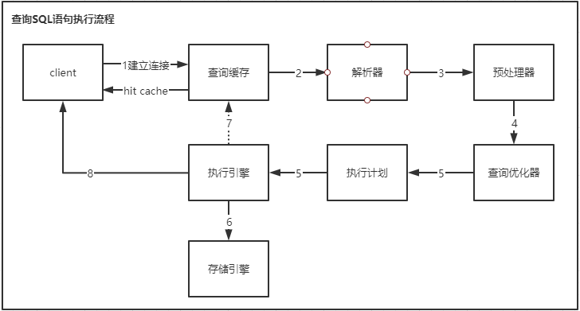
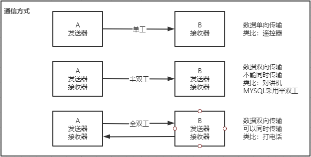
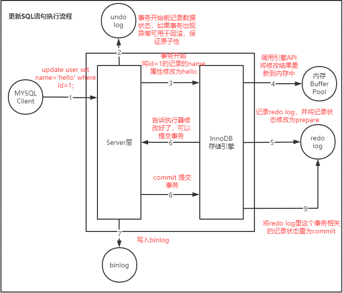
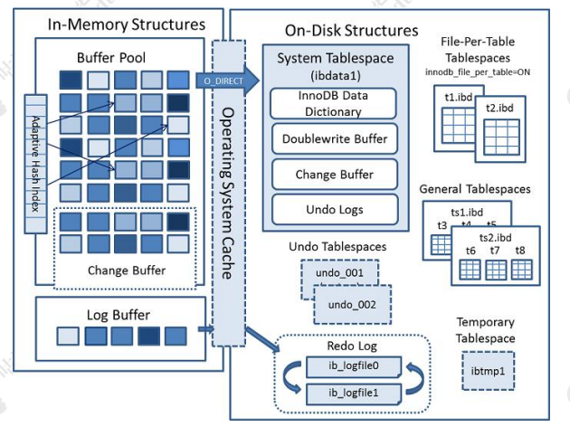

# MYSQL之SQL语句的执行流程分析

## 一、查询SQL语句的执行流程

### 1、上图



### 2、分析

**1）建立连接**

MYSQL采用半双工的通信方式。

```text
单工 - 数据单向发送
半双工 - 数据双向传输，不能同时传输
全双工 - 数据双向传输，可以同时传输
```



**2）查询缓存**

通过 show variables like 'query_cache%'; 查看缓存参数配置；

默认查询缓存没有开启，也就是说默认不推荐使用；

查询缓存的特点：

> 1、要求 SQL 语句必须一模一样；
>
> 2、表里面任何一条数据发生变化时，这张表所有缓存都会失效，所以对于有大量数据更新的应用，也不适合。所以缓存这一块，一般都是交给ORM框架或独立的缓存服务，如：MyBatis 默认开启了一级缓存。
>
> 在 MySQL 8.0 中，查询缓存已经被移除了。

**3）解析器和预处理器**

主要是对 SQL 语句基于 SQL 语法进行词法和语法分析和语义的解析。

**词法解析**：就是把一个完整的 SQL 语句打碎成一个个的单词。

**语法解析**：语法分析会对 SQL 做一些语法检查，比如单引号有没有闭合，然后根据 MySQL 定义的语法规则，根据 SQL 语句生成一个数据结构。这个数据结构我们把它叫做解析树（select_lex）。任何数据库的中间件，比如 Mycat，Sharding-JDBC（用到了 Druid Parser），都必须要有词法和语法分析功能，在市面上也有很多的开源的词法解析的工具（比如 LEX，Yacc）。

**预处理器：**检查生成的解析树，解决解析器无法解析的语义。比如，它会检查表和列名是否存在，检查名字和别名，保证没有歧义。预处理之后得到一个新的解析树。

**4）查询优化器 与查询执行计划 **

查询优化器的目的就是根据解析树生成不同的执行计划（Execution Plan），然后选择一种最优的执行计划，MYSQL 里面使用的是基于开销（cost）的优化器，哪种执行计划开销最小，就用哪种。

查询优化器通过复杂的算法实现尽可能优化查询效率的目标。

优化器最终会把解析树变成一个查询执行计划，查询执行计划是一个数据结构。

**5）存储引擎**

**MyISAM** 

> 支持表级别的锁（插入和更新会锁表）。不支持事务。
>
> 拥有较高的插入（insert）和查询（select）速度。
>
> 存储了表的行数（count 速度更快）。
>
> 适合：只读之类的数据分析的项目。

 **InnoDB** 

> 支持事务，支持外键，因此数据的完整性、一致性更高。
>
> 支持行级别的锁和表级别的锁。
>
> 支持读写并发，写不阻塞读（MVCC）。
>
> 特殊的索引存放方式，可以减少 IO，提升查询效率。
>
> 适合：经常更新的表，存在并发读写或者有事务处理的业务系统。

 **Memory** 

>  把数据放在内存里面，读写的速度很快，但是数据库重启或者崩溃，数据会全部消失。只适合做临时表。 

 **CSV** 

>  不允许空行，不支持索引。格式通用，可以直接编辑，适合在不同数据库之间导入导出。 


## 二、更新SQL语句的执行流程

更新包含 insert / update / delete 语句。

### 1、上图



### 2、分析

更新SQL的执行流程与上面查询SQL的执行流程基本是一致的，也就是说，要经过解析器、优化器的处理，然后交给执行器。区别就在于拿到符合条件的数据之后的操作，所以主要分析后面不同的点。

1）Client端发起update语句

```sql
update user set name='hello' where id=1;
```

2）查找数据

先从内存(Buffer Pool)或磁盘获取这条数据，返回给 Server 的执行器。

3） 事务开始前将数据写入`undo log`

如果事务出现异常可用于回滚，保证原子性 。

4）开始事务`begin`，并修改id=1的记录的name属性为hello

5）更新修改后的数据到内存中

调用引擎API将修改结果更新到内存中 

6） 记录`redo log`，并将记录状态修改为prepare 

7） 响应执行器，告诉其修改好了，可以提交事务 

8）写入`binlog`

9）提交事务`commit`

10）将`redo log`里这个事务相关的记录状态置为`commit `


## 三、缓冲池 Buffer Pool

InnnoDB 的数据都是放在磁盘上的，InnoDB 操作数据有一个最小的逻辑单位，叫做页（索引页和数据页）。

对于数据的操作，不是每次都直接操作磁盘，因为磁盘的速度太慢了。InnoDB 使用了一种缓冲池的技术，也就是把磁盘读到的页放到一块内存区域里面。这个内存区域就叫 Buffer Pool。 

修改数据的时候，先修改缓冲池里面的页。当内存的数据页和磁盘数据不一致的情况叫做脏页。InnoDB 里面有专门的后台线程把 Buffer Pool 的数据写入到磁盘， 每隔一段时间就一次性地把多个修改写入磁盘，这个动作就叫做刷脏。

**InnoDB 内存结构和磁盘结构**



### InnoDB 内存结构

Buffer Pool 主要分为 3 个部分： Buffer Pool、Change Buffer、Adaptive Hash Index、（redo）log buffer。 

#### 1、Buffer Pool

Buffer Pool 缓存的是页面信息，包括数据页、索引页。

Buffer Pool 默认大小是 128M（134217728 字节），可以调整。

```sql
-- 查看服务器状态 Buffer Pool
SHOW STATUS LIKE '%innodb_buffer_pool%';
-- 查看系统变量
SHOW VARIABLES like '%innodb_buffer_pool%';
```

内存缓冲区对于提升读写性能有很大的作用。当需要更新一个数据页时，如果数据页在 Buffer Pool 中存在，可直接更新。

#### 2、Change Buffer 

如果这个数据页不是唯一索引，不存在数据重复的情况，也就不需要从磁盘加载索引页判断数据是不是重复（唯一性检查）。这种情况下可以先把修改记录在内存的缓冲池中，从而提升更新语句（Insert、Delete、Update）的执行速度，这一块区域就是 Change Buffer（写缓冲）。

如果数据库大部分索引都是非唯一索引，并且业务是写多读少，不会在写数据后立刻读取，就可以使用 Change Buffer（写缓冲）。

```sql
-- 查看写缓冲的最大值
SHOW VARIABLES LIKE 'innodb_change_buffer_max_size';
```

#### 3、Adaptive Hash Index

自适应哈希索引存放到内存

#### 4、Redo Log Buffer

思考一个问题：如果 Buffer Pool 里面的脏页还没有刷入磁盘时，数据库宕机或者重 启，这些数据丢失。如果写操作写到一半，甚至可能会破坏数据文件导致数据库不可用。 

为了避免这个问题，InnoDB 把所有对页面的修改操作专门写入一个日志文件，并且在数据库启动时从这个文件进行恢复操作（实现 crash-safe）——用它来实现事务的持久性。 

这个文件就是磁盘的 redo log（叫做重做日志），对应于/var/lib/mysql/目录下的 ib_logfile0 和 ib_logfile1，每个 48M。 这 种 日 志 和 磁 盘 配 合 的 整 个 过 程 ， 其 实 就 是 MySQL 里 的 WAL 技 术 （Write-Ahead Logging），它的关键点就是先写日志，再写磁盘。刷盘是随机 I/O，而记录日志是顺序 I/O，顺序 I/O 效率更高。因此先把修改写入日志，可以延迟刷盘时机，进而提升系统吞吐。

```
show variables like 'innodb_log%';
```

redo log 也不是每一次都直接写入磁盘，在 Buffer Pool 里面有一块内存区域 （Log Buffer）专门用来保存即将要写入日志文件的数据，默认 16M，它一样可以节省磁盘 IO。 

注意：redo log 的内容主要是用于崩溃恢复。磁盘的数据文件，数据来自 buffer pool。redo log 写入磁盘，不是写入数据文件。 

```sql
-- 查看log buffer 写入磁盘的参数，默认1实时写，实时刷
SHOW VARIABLES LIKE 'innodb_flush_log_at_trx_commit';
```

0 - 延迟写；log buffer 将每秒一次地写入 log file 中，并且 log file 的 flush 操作同时进行。该模式下，在事务提交的时候，不会主动触发写入磁盘的操作。

1 - 实时写，实时刷；每次事务提交时 MySQL 都会把 log buffer 的数据写入 log file，并且刷到磁盘中去。

2 - 实时写，延迟刷；每次事务提交时 MySQL 都会把 log buffer 的数据写入 log file。但是 flush 操作并不会同时进行。该模式下，MySQL 会每秒执行一次 flush 操作。

### InnoDB 磁盘结构

表空间可以看做是 InnoDB 存储引擎逻辑结构的最高层，所有的数据都存放在表空间中。

#### 1、系统表空间

**system tablespace**

InnoDB 的页和操作系统的页大小不一致，InnoDB 页大小一般为 16K，操作系统页大小为 4K，InnoDB 的页写入到磁盘时，一个页需要分 4 次写。 

#### 2、独占表空间

**file-per-table tablespaces**

```sql
-- 查看独占表空间参数
SHOW VARIABLES LIKE 'innodb_file_per_table';
```

开启后，则每张表会开辟一个表空间，这个文件就是数据目录下的 ibd 文件（例如 /var/lib/mysql/gupao/user_innodb.ibd），存放表的索引和数据。

#### 3、通用表空间

**general tablespaces** 

通用表空间也是一种共享的表空间，跟 ibdata1 类似。 可以创建一个通用的表空间，用来存储不同数据库的表，数据路径和文件可以自定义。

#### 4、临时表空间

**temporary tablespaces**

存储临时表的数据，包括用户创建的临时表，和磁盘的内部临时表。对应数据目录下的 ibtmp1 文件。当数据服务器正常关闭时，该表空间被删除，下次重新产生。 


## 四、MYSQL中的几种日志文件

### 1、redo log

**重做日志**，记录事务执行过程中的修改操作，实现事务的持久性。

redo log 的大小是固定的，前面的内容会被覆盖。

### 2、undo log

**回滚日志**，记录事务发生前的数据（快照），实现事务的原子性。

在执行 undo 的时候，仅仅是将数据从逻辑上恢复至事务之前的状态，而不是从物 理页面上操作实现的，属于逻辑格式的日志。 

### 3、binlog

**二进制日志**，记录对数据库操作的SQL语句（DDL和DML语句），用于数据恢复和实现主从复制。

binlog文件内容是可以追加的，没有固定大小限制。 

### 4、relay log

**中继日志**，主从数据同步时保存主库中binlog中的SQL语句，用于重放，实现数据复制。