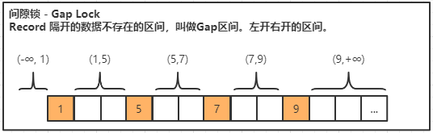

# 一、事务

## 1、什么是事务？

事务是数据库管理系统（DBMS）执行过程中的一个逻辑单位，由一个有限的数据库操作序列构成。

它是数据库最小的工作单元，是不可以再分的。

## 2、事务的ACID

### 1）原子性 A - Atomicity

对数据库的一系列的操作，要么都是成功，要么都是失败，不可能出现部分成功或者部分失败的情况。原子性，在 InnoDB 里面是通过 undo log 来实现的，它记录了数据修改之前的值（逻辑日志），一旦发生异常，就可以用 undo log 来实现回滚操作。

### 2）一致性 C - consistent

指数据库的完整性约束没有被破坏，事务执行的前后都是合法的数据状态。比如主键必须是唯一的，字段长度符合要求。用户自定义的完整性通常要在代码中控制。

### 3）隔离性 I - Isolation

隔离性表示的是多个事务之间是互不干扰，通过其保证业务数据的一致性。

### 4）持久性 D - Durable

对数据库的任意的操作，增删改，只要事务提交成功，那么结果就是永久性的，不可能因为我们系统宕机或者重启了数据库的服务器，它又恢复到原来的状态了。这个就是事务的持久性。

持久性是通过 redo log 和 double write 双写缓冲来实现的，我们操作数据的时候会先写到内存的 buffer pool 里面，同时记录 redo log，如果在刷盘之前出现异常，在重启后就可以读取 redo log 的内容，写入到磁盘，保证数据的持久性。

原子性，隔离性，持久性，最后都是为了实现一致性。


## 3、事务并发带来的问题

### 1）脏读

读取到其他事务未提交的数据。

### 2）不可重复读

一个事务读取到了其他事务已提交的数据导致前后两次读取数据不一致的情况，这种情况就是不可重复读。

### 3）幻读

一个事务前后两次读取数据数据不一致，是由于其他事务插入数据造成的，这种情况我们把它叫做幻读。

**不可重复读和幻读的区别在那里呢？**

**不可重复读是修改或者删除，幻读是插入。**

无论是脏读，还是不可重复读，还是幻读，它们都是数据库的读一致性的问题，都是在一个事务里面前后两次读取出现了不一致的情况。读一致性的问题，必须要由数据库提供一定的事务隔离机制来解决。


## 4、事务隔离级别

**隔离级别越高，事务的并发度就越低。**

由数据库提供一定的事务隔离级别，来解决事务并发的问题，这个就是 SQL92 标准。

### 1）Read Uncommitted（未提交读）

一个事务读取到其他事务未提交的数据，这种情况叫做脏读。

RU 没有解决任何的问题。

### 2）Read Committed（已提交读）

一个事务读取到其他事务已提交的数据，这种情况叫做不可重复读。
> 也就是说一个事务第二次查询出的数据与第一次是不相同的，这就导致了数据的不一致，所以是不可重复读的。

RC 解决了脏读的问题，但是会出现不可重复读的问题。

RC 隔离级别下，普通的 select 都是快照读，使用 MVCC 实现。

### 3）Repeatable Read (可重复读)

在同一个事务里面多次读取同样的数据结果是一样的，但这种级别下没有定义解决幻读的问题。

InnoDB 在 RR 的级别通过临键锁解决了幻读的问题。这也是InnoDB 默认使用 RR 作为事务隔离级别的原因，既保证了数据的一致性，又支持较高的并发度。

> 普通的 select 使用快照读(snapshot read)，底层使用 MVCC 来实现。
>
> 加锁的 select(select ... in share mode / select ... for update)以及更新操作update, delete 等语句使用当前读（current read），底层使用记录锁、或者间隙锁、临键锁。

### 4）Serializable（串行化）

最高的隔离级别，强制所有的事务串行执行，所以它解决了所有的问题。

Serializable 所有的 select 语句都会被隐式的转化为 select ... in share mode，会和 update、delete 互斥。


## 5、如何解决读一致性问题？

如果要解决读一致性的问题，保证一个事务中前后两次读取数据结果一致，实现事务隔离，应该怎么做？

### 1）LBCC - 锁的并发控制

在读取数据时，锁定要操作的数据，阻止其他事务对数据进行修改，这种方案叫做基于锁的并发控制 Lock Based Concurrency Control（LBCC）。

基于锁来实现事务隔离，一个事务读取的时候不允许其他时候修改，那就意味着不支持并发的读写操作，而我们的大多数应用都是读多写少的，这样会极大地影响操作数据的效率。

### 2）MVCC - 多版本并发控制

在事务开始前，给数据生成一个快照（Snapshot)，并用这个快照来提供一定级别（语句级或事务级）的一致性读取，这种方案叫做多版本并发控制 Multi Version Concurrency Control（MVCC）。

MVCC 的核心思想： 可以查到在事务开始之前已经存在的数据，即使它在后面被修改或者删除了。但在这个事务之后新增的数据是查不到的。


#### 2.1）隐藏的`事务ID`字段 - 版本号

InnoDB 为每行记录都实现了两个隐藏的`事务ID`字段，也就是所谓的版本号。 

**DB_TRX_ID**

> 6 字节：插入或更新行的最后一个事务的事务 ID，事务编号是自动递增的。
>
> 可以把它理解为`创建版本号`，在数据新增或者修改为新数据的时候，记录当前事务 ID。 

**DB_ROLL_PTR**

> 7 字节：回滚指针。
>
> 可以把它理解为`删除版本号`，数据被删除或记录为旧数据的时候，记录当前事务 ID。 


#### 2.2）MVCC 流程演示【重点】

##### **步骤一：事务1**

```sql
-- 事务1 - 初始化数据
begin;
INSERT INTO t_mvcctest(`name`) VALUES ('jesse');
INSERT INTO t_mvcctest(`name`) VALUES ('coy');
commit;
```

此时的数据，创建版本号是当前事务 ID，删除版本号为空。

| id   | name  | 创建版本号 | 删除版本号 |
| ---- | ----- | ---------- | ---------- |
| 1    | jesse | 1          | undefined  |
| 2    | coy   | 1          | undefined  |


##### **步骤二：事务2**

```sql
-- 事务2 - 查询操作
set session autocommit=off;

begin;
-- (1) 第一次查询，事务1新增2条记录，查找到两条原始数据
select * from t_mvcctest ;
```


##### **步骤三：事务3**

```sql
-- 事务3 - 新增操作
set session autocommit=off;

begin;
INSERT INTO t_mvcctest(`name`) VALUES ('pangzi');
commit;
```

此时的数据，多了一条数据 pangzi，它的创建版本号为`当前事务ID 3`。

| id   | name   | 创建版本号 | 删除版本号 |
| ---- | ------ | ---------- | ---------- |
| 1    | jesse  | 1          | undefined  |
| 2    | coy    | 1          | undefined  |
| 3    | pangzi | **`3`**    | undefined  |


##### **步骤四：事务2**

在 事务2 中继续执行如下查询SQL。

```sql
-- (2) 第二次查询，事务3新增1条记录，但只能查找到两条原始数据
-- 查找规则：只能查找创建版本号小于等于当前事务 ID 的数据，和删除版本号大于当前事务 ID 的行（或未删除）。
select * from t_mvcctest ;
```

**结论：**不能查到在事务开始之后插入的数据。
> pangzi 的创建版本号大于 2，所以还是只能查到两条数据。


##### **步骤五：事务4**

```sql
-- 事务4 - 删除操作
set session autocommit=off;

begin;
delete from t_mvcctest where id=2;
commit;
```

此时的数据，coy 的删除版本被记录为当前事务ID 4，其他数据不变。

| id   | name   | 创建版本号 | 删除版本号 |
| ---- | ------ | ---------- | ---------- |
| 1    | jesse  | 1          | undefined  |
| 2    | coy    | 1          | **`4`**    |
| 3    | pangzi | 3          | undefined  |


##### **步骤六：事务2**

在 事务2 中继续执行如下查询SQL。

```sql
-- (3) 第三次查询，事务4删除1条记录，但只能查找到两条原始数据
-- 查找规则：只能查找创建版本号小于等于当前事务 ID 的数据，和删除版本号大于当前事务 ID 的行（或未删除）。
select * from t_mvcctest ;
```

**结论：**可以查到在事务开始之后删除的数据。
> coy 的删除版本号大于 2，所以还是能查到两条原始数据。


##### **步骤七：事务5**

```sql
-- 事务5 - 更新操作
set session autocommit=off;
begin;
update t_mvcctest set name ='jesse2' where id=1;
commit;
```

更新数据的时候，旧数据的删除版本被记录为当前事务 ID 5（undo），产生了一条新数据，其创建版本号 ID 为当前事务 ID 5。

| id   | name   | 创建版本号 | 删除版本号 |
| ---- | ------ | ---------- | ---------- |
| 1    | jesse  | 1          | **`5`**    |
| 2    | coy    | 1          | 4          |
| 3    | pangzi | 3          | undefined  |
| 1    | jesse2 | **`5`**    | undefined  |


##### **步骤八：事务2**

在 事务2 中继续执行如下查询SQL。

```sql
-- (4) 第四次查询，事务5修改1条记录，但只能查找到原始数据
-- 查找规则：只能查找创建版本号小于等于当前事务 ID 的数据，和删除版本号大于当前事务 ID 的行（或未删除）。
select * from t_mvcctest ;
```

结论：**不能查到在事务开始之后修改的数据**。

因为更新后的数据 jesse2 创建版本号大于 2，代表在事务之后增加的，查不出来。 

而旧数据 jesse 的删除版本号大于 2，代表在事务之后删除的，可以查出来。 


##### **总结**

通过上面的演示，可以得出结论：**通过版本号的控制，无论其他事务是插入、修改、删除， 第一个事务查询到的数据都没有变化。**

在 InnoDB 中，MVCC 是通过 Undo log 实现的。

需要注意的是，在 InnoDB 中，MVCC 和锁是协同使用的，这两种方案并不是互斥的。


# 二、锁

## 1、锁的粒度

### 1）表锁

表锁，顾名思义，是锁住一张表。

### 2）行锁

行锁，就是锁住表里面的一行数据。

### 3）表锁和行锁的区别

3.1）锁定粒度，表锁的锁定粒度大于行锁。 

3.2）冲突概率，表锁的冲突概率大于行锁。

> 当锁住一张表的时候，其他事务都不能操作这张表。但是锁住表里的一行数据时，其他事务还可以来操作表里面的其他没有被锁定的行。

3.3）加锁效率，表锁的加锁效率大于行锁。

> 表锁是直接锁住这张表，而行锁，还需要在表里面去检索这一行数据，所以表锁的加锁效率更高。 

3.4）并发效率，表锁的并发效率小于行锁。

> 表锁的冲突概率更大，所以并发性能更低。


## 2、锁的类型

### 1）共享锁（行锁）

共享锁又称为读锁（Shared Locks），简称S锁，顾名思义，共享锁就是多个事务对于同一数据可以共享一把锁，都能访问到数据，但是只能读不能修改。

**加锁方式**

用 select  ......  LOCK IN SHARE MODE; 的方式加锁。

```sql
select * from user where id=1 LOCK IN SHARE MODE;
```

**释放锁的方式**

只要事务结束，锁就会自动释放，包括提交事务和结束事务。 

### 2）排它锁（行锁）

排它锁又称为写锁（Exclusive Locks），简称X锁，排他锁不能与其他锁并存，如一个事务获取了一个数据行的排他锁，其他事务就不能再获取该行的锁（共享锁、排他锁），只有该获取了排他锁的事务是可以对数据行进行读取和修改。

**加锁方式**

自动：delete / update / insert 默认加上X锁；

手动：select \* from student where id=1 FOR UPDATE;

 **释放锁的方式**

只要事务结束，锁就会自动释放，包括提交事务和结束事务。

### 3）意向锁（表锁）

意向锁是由数据库引擎自己维护的，用户无法手动操作意向锁 。

**意向共享锁 - Intention Shared Lock**

> 表示事务准备给数据行加入共享锁，也就是说一个数据行加共享锁前必须先取得该表的IS锁。

**意向排它锁 - Intention Exclusive Lock**

> 表示事务准备给数据行加入排他锁，说明事务在一个数据行加排他锁前必须先取得该表的IX锁。

在加锁的时候，必须要去只要判断有没其他的事务锁定了其中了某些行，如果有，肯定不能给表加锁，这时就需要去扫描整张表才能确定能不能成功加上一个表锁，如果数据量比较大，效率会非常差，所以引入了意向锁。

我们只需判断这张表上面有没有意向锁，如果有，就直接返回失败。如果没有，就可以加锁成功。所以 InnoDB 里面的表锁，我们可以把它理解成一个标志。

**锁的作用是什么？**

> 它跟 Java 里面的锁是一样的， 是为了解决资源竞争的问题，Java 里面的资源是对象，数据库的资源就是数据表或者数据行。 锁是用来解决事务对数据的并发访问的问题的。

**那么锁到底锁住了什么呢？**

> 在没有索引或者没有用到索引的情况下，会锁住整张表。

InnoDB 的行锁，就是通过锁住索引来实现的。


## 3、锁的原理

### 1）没有索引的表

> 在没有索引或者没有用到索引的情况下，会锁住整个表，也就是表锁。实质锁定的是隐藏的ROWID聚集索引。而表锁实际锁的是整个索引树。

### 2）有主键索引的表

> 在有主键索引的表，会锁定一行记录。

### 3）唯一索引

> 通过唯一索引找到主键的键值，再查找到主键索引，然后再锁定。

### 4）关于索引的两个问题

**1、为什么表里面没有索引的时候，锁住一行数据会导致锁表？**

> 1）如果定义了主键(PRIMARY KEY)，那么 InnoDB 会选择主键作为聚集索引。 
>
> 2）如果没有显式定义主键，则 InnoDB 会选择第一个不包含有 NULL 值的唯一索引作为主键索引。 
>
> 3）如果也没有这样的唯一索引，则 InnoDB 会选择内置 6 字节长的 ROWID 作为隐藏的聚集索引，它会随着行记录的写入而主键递增。 
>
> 所以，为什么锁表，是因为查询没有使用索引，会进行全表扫描，然后把隐藏的聚集索引锁住。

**2、为什么通过唯一索引给数据行加锁，主键索引也会被锁住？**

> 在辅助索引里面，索引存储的是二级索引和主键的值。而主键索引里面除了索引之外，还存储了完整的数据。所以通过辅助索引锁定一行数据的时候，它跟检索数据的步骤是一样的，会通过主键值找到主键索引，然后再锁定。


## 4、锁的算法

### 1）记录锁 - Record Lock


对于唯一性的索引（包括唯一索引和主键索引）使用等值查询，精准匹配到一条记录时，使用的就是记录锁。

> 使用不同的 key 去加锁，不会冲突，它只锁住这个 record。 


### 2）间隙锁 - Gap Lock



查询的记录不存在，没有命中任何一个 record，无论是用等值查询还是范围查询，使用的都是间隙锁。 

注意，间隙锁主要是阻塞插入 insert。相同的间隙锁之间不冲突。 

> Gap Lock 只在 RR 中存在。如果要关闭间隙锁，就是把事务隔离级别设置成 RC，并且把 innodb_locks_unsafe_for_binlog 设置为 ON。 
>
> 这种情况下除了外键约束和唯一性检查会加间隙锁，其他情况都不会用间隙锁。 


### 3）临键锁 - Next Key Lock


当使用范围查询，不仅仅命中了 Record 记录，还包含了 Gap 间隙，在这种情况下使用的就是临键锁，它是 MySQL 里面默认的行锁算法，相当于记录锁加上间隙锁。

临键锁，通过锁住最后一个 key 的下一个左开右闭的区间来解决幻读的问题。


### 4）总结

InnoDB 的 RR 级别能够解决幻读的问题，就是用临键锁来解决的。 


## 5、死锁

### 1）锁的释放和阻塞

**释放：**

在事务结束或者客户端连接断开时会释放锁。

**阻塞：**

对于同一个数据资源（数据表或数据行），如果一个事务一直未释放锁，其他事务获取该数据资源时会被阻塞。可以通过下面的参数来控制获取锁的等待时间，避免一直等待锁。

```sql
-- 查看获取锁的等待时间参数，默认50s
show VARIABLES like 'innodb_lock_wait_timeout';
```

思考：对于死锁，无论等待多长时间都不能获得锁，这种情况下，也需要等待50s吗？

### 2）死锁的条件

#### 2.1）互斥条件

同一时刻只能有一个事务持有这把锁。

#### 2.2）不可剥夺条件

其他事务必须等待持有锁的事务释放锁之后才能获取锁，不能强行剥夺。

#### 2.3）请求与保持条件

一个事务因获取数据资源的锁而阻塞时，对已获取的锁保持不放。

#### 2.4）循环等待条件

多个事务之间形成一种循环等待数据资源锁的关系，也就是环路。


**以上这四个条件是死锁的必要条件，只要发生死锁，这些条件必然成立，而只要上述条件之一不满足，就不会发生死锁。**


### 3）死锁的检测

InnoDB 一般都能通过算法（wait-for graph）自动检测到死锁，并立马退出。

### 4）查看锁信息

如果锁一直没有释放，就有可能造成大量阻塞或者发生死锁，造成系统吞吐量下降， 这时就需要查看是哪些事务持有了锁，然后采取相应的措施。

```sql
-- 查看行锁信息
show status like 'innodb_row_lock_%';
-- 查询当前运行的所有事务和具体语句
select * from information_schema.INNODB_TRX;
-- 查询当前出现的锁
select * from information_schema.INNODB_LOCKS; 
-- 查询锁等待的对应关系
select * from information_schema.INNODB_LOCK_WAITS; 
```

> Innodb_row_lock_current_waits：当前正在等待锁定的数量； 
>
> Innodb_row_lock_time ：从系统启动到现在锁定的总时间长度，单位 ms； 
>
> Innodb_row_lock_time_avg ：每次等待所花平均时间； 
>
> Innodb_row_lock_time_max：从系统启动到现在等待最长的一次所花的时间； 
>
> Innodb_row_lock_waits ：从系统启动到现在总共等待的次数。 

如果一个事务长时间持有锁不释放，可以 kill 事务对应的线程 ID，也就是INNODB_TRX 表中的 trx_mysql_thread_id，例如执行 kill 4，kill 7，kill 8。

### 5）死锁的避免

1、操作多个表时，尽量以相同的顺序来访问，避免形成等待环路；

2、申请足够级别的锁，如果要操作数据，就申请排它锁；

3、尽量使用索引访问数据，避免没有 where 条件的操作，避免锁表；

4、大事务化成小事务；

5、尽量使用等值查询而不是范围查询，命中记录，避免间隙锁对并发的影响。

