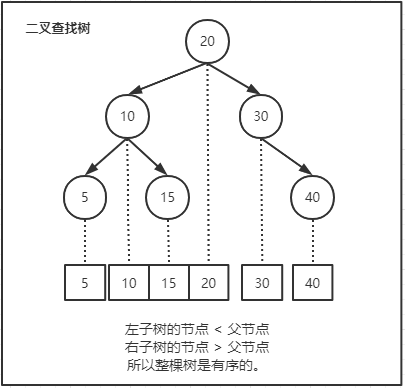
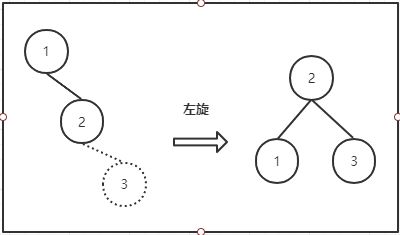
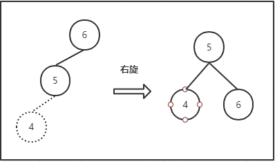
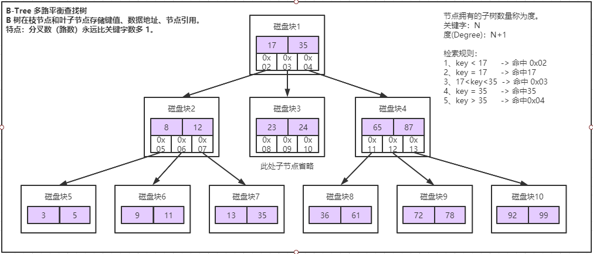
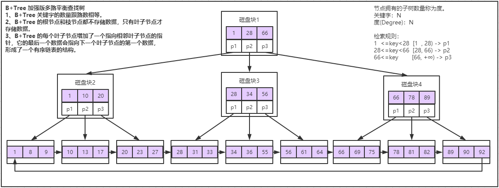
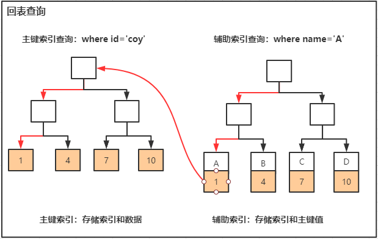
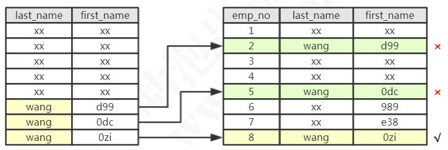
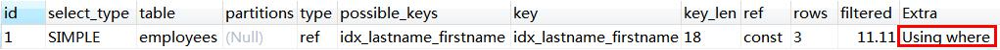
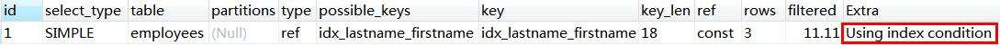

# MYSQL索引分析

## 一、索引是什么

维基百科对数据库索引的定义：

**数据库索引，是数据库管理系统（DBMS）中一个排序的数据结构，以协助快速查询、 更新数据库表中数据。** 

### 1、**聚集索引** 

> 数据行的物理顺序与键值的逻辑顺序相同，一个表中只能拥有一个聚集索引。 
>
> 主键就是聚集索引。创建表时如果不创建索引，系统会自动创建一个隐含列作为表的聚集索引。 最好还是在创建表的时候添加聚集索引 。

### 2、**非聚集索引**

>  索引的逻辑顺序与磁盘上行的物理存储顺序不同，一个表中可以拥有多个非聚集索引。 

在 InnoDB 里面，索引类型有三种，普通索引、唯一索引（主键索引是特殊的唯一索引）、全文索引。

**普通索引（Normal）**

> 也叫非唯一索引，是最普通的索引，没有任何的限制。 

**唯一索引（Unique）**：

> 唯一索引要求键值不能重复。另外需要注意的是，主键索引是一种特殊的唯一索引，它还多了一个限制条件，要求键值不能为空。主键索引用 primay key 创建。 

**全文索引（Fulltext）**：

> 针对比较大的数据，比如我们存放的是消息内容，有几 KB 的数 据的这种情况，如果要解决like 查询效率低的问题，可以创建全文索引。只有文本类型 的字段才可以创建全文索引，比如 char、varchar、text。 


## 二、索引存储模型推演


### 1、二叉查找树 BST

BST - Binary Search Tree

> 动图网址： https://www.cs.usfca.edu/~galles/visualization/BST.html 

**特点：**

左子树所有的节点都小于父节点，右子树所有的节点都大于父节点。也就是说二叉查找树是一个有序的线性表。

二叉查找树通过二分查找来查找数据。



**优点：**

二叉查找树既能够实现快速查找，又能够实现快速插入。

**缺点：**

查找耗时和树的深度相关，在最坏的情况下时间复杂度会退化成O(n)，也就是退化为了一个链表，这种情况下不能达到加快检索速度的目的，和顺序查找效率是一样的。  因为左右子树深度差太大，导致树的左子树根本没有节点——也就是它不够平衡。


### 2、平衡二叉查找树 AVL Tree

AVL Tree - Balanced Binary Search Trees

> 动图网址： https://www.cs.usfca.edu/~galles/visualization/AVLtree.html 

**平衡二叉查找树的定义：左右子树深度差绝对值不能超过 1。**

#### 2.1 怎么保证树是平衡的呢？

也就是说怎么保证左右子树的深度差不超过 1 呢？

比如按顺序插入 1、2、3、4、5、6。

**1）左旋**

当插入 1、2 之后，如果按照二叉查找树的定义，3 肯定是要在 2 的右边的，这时根节点 1 的右节点深度会变成 2，但是左节点的深度是 0，因为它没有子节点，所以就会违反平衡二叉树的定义。

因为右节点下面接一个右节点，右右型，所以这时我们要把 2 提上去，这个操作叫做左旋。



**2）右旋**

同样，插入 6、5、4，这个时候会变成左左型，就会发生右旋操作，把 5 提上去。



#### 2.2 索引存储什么内容呢？

在平衡二叉树中，一个节点，它的大小是一个固定的单位，那么作为索引应该存储什么内容？ 

**1）索引的键值**

> 比如我们在 id 上面创建了一个索引，在用 where id =1 的条件查询时就会找到索引里面的 id 的这个键值。 

**2）数据的磁盘地址**

> 索引的作用就是去查找数据的存放地址。 

**3）左右子节点的引用**

> 因为是二叉树，它必须还要有左子节点和右子节点的引用，这样才能找到下一个节点。

**分析**

当我们用树的结构来存储索引的时候，访问一个节点就要跟磁盘之间发生一次 IO。 

InnoDB 操作磁盘的最小的单位是一页（或者叫一个磁盘块），大小是 16K(16384 字节)。 

```sql
-- 查看数据和索引的大小
SELECT
	CONCAT( ROUND( SUM( DATA_LENGTH / 1024 / 1024 ), 2 ), 'MB' ) AS data_len,
	CONCAT( ROUND( SUM( INDEX_LENGTH / 1024 / 1024 ), 2 ), 'MB' ) AS index_len
FROM information_schema.TABLES WHERE table_schema = 'coy' AND table_name = 'user_info';
```

如果我们一个节点只存一个键值+数据+引用，例如整形的字段，可能只用了十几个或者几十个字节，它远远达不到 16K 的容量，所以访问一个树节点，进行一次 IO 的时候，浪费了大量的空间。 

所以如果每个节点存储的数据太少，从索引中找到我们需要的数据，就要访问更多的节点，意味着跟磁盘交互次数就会过多。

**缺点：**

 1、索引节点存储的数据太少，一方面浪费大量空间，另一方面磁盘IO操作次数多，性能低。

2、数据越多树的深度越高，查询性能越低。


### 3、多路平衡查找树 B-Tree

Binary Tree

> 动图网址： https://www.cs.usfca.edu/~galles/visualization/BTree.html 

跟 AVL 树一样，B-Tree 在枝节点和叶子节点存储键值、数据地址、节点引用。

**特点：**

分叉数（路数）永远比关键字数多 1。

分裂：当Max Degree为3时，若新增关键字时数量为3，则需要进行分裂操作。

合并：如果删除节点，则需要进行合并操作。



**分析：**

在更新索引的时候会有大量的索引的结构的调整，所以为什么我们建议不要在频繁更新的列上建索引，或者为什么不要更新主键。 

节点的分裂和合并，其实就是 InnoDB 页的分裂和合并。

**优点：**

B-Tree 实现一个节点存储多个关键字

**缺点：**

相对AVL树B-Tree在空间利用率上已经有一定的提升，但因为每个节点存储了数据，所以可存储的键值还是很少，查找时还是会导致磁盘IO操作比较频繁。


### 4、加强版多路平衡查找树 B+Tree

B+Tree

> 动图网址： https://www.cs.usfca.edu/~galles/visualization/BPlusTree.html 

**特点：**

1）关键字的数量是跟路数相等的；

2）B+Tree 的根节点和枝节点中都不会存储数据，只有叶子节点才存储数据。

搜索到关键字不会直接返回，会一直往下搜索到最后一层的叶子节点。在查找数据时一次页的查找代表一次 IO，也就是说，一张 2000 万左右的表，查询数据最多需要访问 3 次磁盘。 所以在 InnoDB 中 B+ 树深度一般为 1-3 层，它就能满足千万级的数据存储。

3）B+Tree 的每个叶子节点增加了一个指向相邻叶子节点的指针，它的最后一个数据会指向下一个叶子节点的第一个数据，形成了一个有序链表的结构。 

4）根据左闭右开的区间 [ )来检索数据。



**优点：**

1）根节点和枝节点不存储数据，只有叶子节点才存储数据。

> 也就是说每个节点可以存储更多关键字，树的路数更多，树的深度更低，所以在 InnoDB 中 B+Tree深度一般为 1-3 层，它就能满足千万级的数据存储。

2）扫库、扫表能力更强

> 如果我们要对表进行全表扫描，只需要遍历叶子节点就可以了，不需要遍历整棵 B+Tree 拿到所有的数据。

3）B+Tree 的磁盘读写能力相对于 B-Tree 更强。

> 因为一个节点可以存储更多的关键字，一次磁盘加载的关键字更多。

4）排序能力更强

> 因为叶子节点上有下一个数据区的指针，数据形成了有序链表。

5）查询效率高

> 因B+Tree是一个有序链表，所以范围查询时，只需要顺着节点和指针顺序遍历就可以一次性访问到所有的数据节点，相当于顺序IO，这极大的提高了区间查询效率，因为不需要返回上层父节点重复遍历查找。

6）查询效率更加稳定

> B+Tree支持更多路数，所以树的深度更低，同时只需从叶子节点加载数据，所以 IO 次数更加稳定。

**缺点：**

B+Tree的写请求是随机分布的，也就是会有大量的随机IO。


## 三、索引的使用原则

### 1、联合索引

联合索引在 B+Tree 中是复合的数据结构，它是按照从左到右的顺序来建立搜索树的。

比如给 user 表中的 name 和 phone 字段上建立一个联合索引。

```sql
ALTER TABLE user add INDEX idx_name_phone (name,phone);
```

**分析：**

name 是有序的，phone 是无序的。当 name 相等的时候，phone 才是有序的。 

如果以条件 ` name='coy'  and phone='13100001111' `去查询数据，B+Tree 会优先比较 name 来确定下一步的搜索是往左还是往右。如果查询条件中没有 name，就不知道下一步应该查哪个节点，因为建立搜索树的时候 name 是第一个比较因子，所以用不到索引。 这里就体现出联合索引的最左匹配原则。

**联合索引的最左匹配原则**

在联合索引中，按照最左匹配原则，用左边的字段去查询时，也能用到索引，若使用中间或右边的字段去查询，则不能用到索引。所以，在建立联合索引的时候，一定要把最常用的列放在最左边。

### 2、覆盖索引

**回表查询**

先通过普通索引的键值定位到主键索引的键值，再通过主键索引的键值定位行记录数据，其需要扫描两次索引B+树，这个过程就叫回表。



在辅助索引里面，不管是单列索引还是联合索引，如果 select 的数据列只用从索引中就能够取得，不必从数据区中读取，这时候使用的索引就叫做**覆盖索引**，这样就避免了回表。因为覆盖索引减少了 IO 次数，减少了数据的访问量，可以大大地提升查询效率。 

### 3、索引条件下推（ICP）

索引条件下推（Index Condition Pushdown）只适用于二级索引。ICP 的目标是减少访问表的完整行的读数量从而减少 I/O 操作。 

```sql
-- 开启ICP
set optimizer_switch='index_condition_pushdown=on';
-- 关闭ICP
set optimizer_switch='index_condition_pushdown=off';
-- 查看参数
show variables like 'optimizer_switch';
```

举例：查询所有姓 wang，并且名字最后一个字是 zi 的员工。

```sql
select * from employees where last_name='wang' and first_name LIKE '%zi' ;
```

**SQL执行方式一：**

 根据联合索引查出所有姓 wang 的二级索引数据，然后回表，到主键索引上查询 全部符合条件的数据（3 条数据）。然后返回给 Server 层，在 Server 层过滤出名字以 zi 结尾的员工。 

**SQL执行方式二：**

根据联合索引查出所有姓 wang 的二级索引数据（3 个索引），然后从二级索引中筛选出 first_name 以 zi 结尾的索引（1 个索引），然后再回表，到主键索引上查询全部符合条件的数据（1 条数据），返回给 Server 层。 



很明显第二种方式到主键索引上查询的数据更少。 索引的比较是在存储引擎进行的，数据记录的比较，是在 Server 层进行的。 而当 first_name 的条件不能用于索引过滤时，Server 层不会把 first_name 的条件传递 给存储引擎，所以读取了两条没有必要的记录。 

执行explain执行计划：

```sql
explain select * from employees where last_name='wang' and first_name LIKE '%zi' ;
```



Extra的值 Using Where 代表从存储引擎取回的数据不全部满足条件，需要在 Server 层过滤。 先用 last_name 条件进行索引范围扫描，读取数据表记录，然后进行比较，检查是否符合 first_name LIKE '%zi' 的条件。


```sql
-- 开启ICP
set optimizer_switch='index_condition_pushdown=on';
```

执行explain执行计划：



Extra的值 Using index condition  代表把 first_name LIKE '%zi'下推给存储引擎后，只会从数据表读取所需的 1 条记录。 