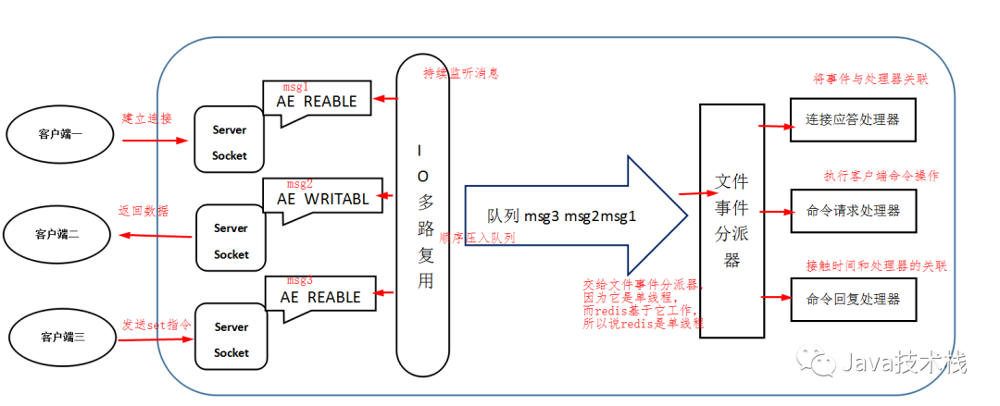

# Redis 单线程到底指什么？
> 大家所熟知的 Redis 确实是单线程模型，指的是执行 Redis 命令的核心模块是单线程的，而不是整个 Redis 实例就一个线程，Redis 其他模块还有各自模块的线程的。
>
> Redis 线程模型：Reactor模式。




### 文件事件处理器

```text
Redis基于Reactor模式开发了`网络事件处理器`，这个处理器被称为`文件事件处理器`。它的组成结构为4部分：多个套接字、IO多路复用程序、文件事件分派器、事件处理器。
因为文件事件分派器队列的消费是单线程的，所以Redis才叫单线程模型。
参考：https://www.jianshu.com/p/6264fa82ac33
```
### 消息处理流程

> 文件事件处理器使用I/O多路复用(multiplexing)程序来同时监听多个套接字，并根据套接字目前执行的任务来为套接字关联不同的事件处理器。
> 当被监听的套接字准备好执行连接应答(accept)、读取(read)、写入(write)、关闭(close)等操作时，与操作相对应的文件事件就会产生，这时文件事件处理器就会调用套接字之前关联好的事件处理器来处理这些事件。
> 
> 尽管多个文件事件可能会并发地出现，但I/O多路复用程序总是会将所有产生事件的套接字都推到一个队列里面，然后通过这个队列，以有序（sequentially）、同步（synchronously
> ）、每次一个套接字的方式向文件事件分派器传送套接字：当上一个套接字产生的事件被处理完毕之后（该套接字为事件所关联的事件处理器执行完毕）， I/O多路复用程序才会继续向文件事件分派器传送下一个套接字。

### I/O 多路复用程序的实现
> Redis的I/O多路复用程序的所有功能是通过包装select、epoll、evport和kqueue这些I/O多路复用函数库来实现的，每个I/O多路复用函数库在Redis源码中都对应一个单独的文件，比如ae_select.c、ae_epoll.c、ae_kqueue.c等。
>
> 因为Redis为每个I/O多路复用函数库都实现了相同的API，所以I/O多路复用程序的底层实现是可以互换的，如下图所示。


# Redis 不仅仅是单线程
> 一般来说 Redis 的瓶颈并不在 CPU，而在内存和网络。如果要使用 CPU 多核，可以搭建多个 Redis 实例来解决。


# 是否使用过Redis集群，集群的原理是什么？
```text
Redis Sentinal着眼于高可用，在master宕机时会自动将slave提升为master，继续提供服务。

Redis Cluster着眼于扩展性，在单个redis内存不足时，使用Cluster进行分片存储。
```

# 如何使用过Redis做异步队列？
```text
一般使用list结构作为队列，rpush生产消息，lpop消费消息。当lpop没有消息的时候，要适当sleep一会再重试。
如果不用sleep，list还有个指令叫blpop，在没有消息的时候，它会阻塞住直到消息到来。
如果想要生产一次消费多次，可以使用pub/sub主题订阅者模式，可以实现1:N的消息队列，但在消费者下线后，生产的消息会丢失，想要持久化的话，需要使用消息队列如rabbitmq等。
```

# redis如何实现延时队列？
```text
使用sortedset，拿时间戳作为score，消息内容作为key调用zadd来生产消息，消费者用zrangebyscore指令获取N秒之前的数据轮询进行处理。
```

# 如果有大量的key需要设置同一时间过期，需要注意什么？
```text
如果大量的key过期时间设置的过于集中，到过期的那个时间点，redis可能会出现短暂的卡顿现象。一般需要在过期时间上加一个随机值，使得过期时间分散一些。
```

# Redis单点吞吐量
```text
单点TPS达到8万/秒，QPS达到10万/秒，补充下TPS和QPS的概念

QPS: 应用系统每秒钟最大能接受的用户访问量。每秒钟处理完请求的次数，注意这里是处理完，具体是指发出请求到服务器处理完成功返回结果。可以理解在server中有个counter，每处理一个请求加1，1秒后counter=QPS。
TPS： 每秒钟最大能处理的请求数。每秒钟处理完的事务次数，一个应用系统1s能完成多少事务处理，一个事务在分布式处理中，可能会对应多个请求，对于衡量单个接口服务的处理能力，用QPS比较合理。
```

# Redis哈希槽
```text
Redis集群没有使用一致性hash,而是引入了哈希槽的概念，当需要在 Redis 集群中放置一个 key-value 时，根据 CRC16(key) mod 16384的值，决定将一个key放到哪个桶中。
```

# Redis集群最大节点个数是多少？
```text
Redis集群预分好16384个桶(哈希槽)
```

# Redis事务是什么？
```text
Redis事务可以一次执行多个命令，有以下特点：

批量操作在发送 EXEC 命令前被放入队列缓存。
收到 EXEC 命令后进入事务执行，事务中任意命令执行失败，其余的命令依然被执行。
在事务执行过程，其他客户端提交的命令请求不会插入到事务执行命令序列中。

事务可以理解为一个打包的批量执行脚本，但批量指令并非原子化的操作，中间某条指令的失败不会导致前面已做指令的回滚，也不会造成后续的指令不做。
```


# Redis 过期策略

Redis 采用了 **“定期删除+惰性删除”** 的过期策略。 

- 定时过期 

> **原理：**为每个设置过期时间的key都创建一个定时器， 用于判断key是否过期，到过期时间就会立即清除。
>
> 该策略可以立即清除过期的数据，对内存很友好；但是会占用大量的CPU资源去处理过期的数据，从而影响缓存的响应时间和吞吐量。

- 惰性删除

> **原理：**惰性删除是在访问一个key 的时候，redis会先去检测一下这个key是否已经过期，如果已经过期，则删除这个key。
>
> 该策略可以最大化地节省CPU资源，却对内存非常不友好。极端情况可能出现大量的过期key没有再次被访问，从而不会被清除，占用大量内存。 

- 定期删除

> **原理：**定期删除指的是redis默认每隔100ms就随机抽取一些设置了过期时间的key，检测这些key是否过期，如果过期了就将其删掉。。
>
> 该策略是前两者的一个折中方案。通过调整定时扫描的时间间隔和每次扫描的限定耗时，可以在不同情况下使得CPU和内存资源达到最优的平衡效果。 

# Redis 内存淘汰策略

Redis的内存淘汰策略是指在Redis用于缓存的内存不足时，怎么处理需要新写入且需要申请额外空间的数据。 redis提供了6中内存淘汰策略，具体如下:
**noeviction**：

>  当内存不足以容纳新写入数据时，新写入操作会报错，无法写入新数据，一般不采用。

**allkeys-lru**：

> 当内存不足以容纳新写入数据时，在键空间中，移除最近最少使用的key，这个是最常用的。

**allkeys-random**：

> 当内存不足以容纳新写入的数据时，在键空间中，随机移除key，一般也不使用。

**volatile-lru**：

>  当内存不足以容纳新写入数据时，在设置了过期时间的键空间中，移除最近最少使用的key（这个一般不太合适）  。

**volatile-random**：

>  当内存不足以容纳新写入数据时，在设置了过期时间的键空间中，随机移除某个key  。

**volatile-ttl**：

> 当内存不足以容纳新写入数据时，在设置了过期时间的键空间中，有更早过期时间的key优先移除。


**总结：**Redis的`内存淘汰策略`的选取并不会影响过期的key的处理。`内存淘汰策略`用于处理内存不足时的需要申请额外空间的数据；`过期策略`用于处理过期的缓存数据。