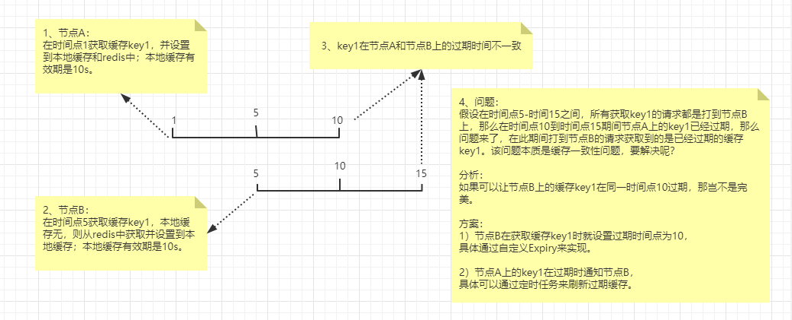

## 关于缓存的几个常见问题分析
- 缓存雪崩

定义：
> 由于大量缓存失效，导致大量请求打到DB上，DB的CPU和内存压力巨大，从而出现一系列连锁反应，造成整个系统崩溃。

方案：
> `Caffeine`默认使用异步机制加载缓存数据，可有效防止缓存击穿（防止同一个key或不同key被击穿的场景）。
> 注：结合`refreshAfterWrite` 异步刷新缓存，。

- 缓存击穿

定义：
> 在平常高并发的系统中，大量的请求同时查询一个 key 时，此时这个key正好失效了，就会导致大量的请求都打到数据库上面去。这种现象我们称为**缓存击穿**。

方案：
> `Caffeine`默认使用异步机制加载缓存数据，可有效防止缓存击穿（防止同一个key或不同key被击穿的场景）。

- 缓存穿透

定义：
> 请求根本就不存在的数据，也就是缓存和数据库都查询不到这条数据，但是请求每次都会打到数据库上面去。这种查询不存在数据的现象我们称为**缓存穿透**。

方案：
> 通过对不存在的key缓存空值，来防止缓存穿透。
> 注：也可以采用BloomFilter来判断key是否存在，来进行过滤

> 注：对于高并发系统，可以结合 `Hystrix` 或 `Sentinel`来做应用级别的限流和降级，以保护下游系统不会被大量的请求给打死。

- 缓存一致性是怎么保证的？

> 问题：分布式缓存的一致性怎么保证？
>
> 思考：
>
> 1、请求走A节点获取数据key1，本地缓存和redis中无缓存，则从DB加载数据，并添加到本地缓存和redis。
> 然后发送redis消息，通知其他节点。
>
> 2、请求走B节点获取数据key1，本地缓存无，redis中有，则添加到本地缓存
>
> 3、请求走A节点获取数据key1，缓存过期，则从DB加载数据，并添加到本地缓存和redis。
> 然后发送redis消息，通知节点B重新加载缓存key1，来保证不同节点的缓存一致性。

> 描述：
>
> 因为 `Caffeine` 在初始化时就指定了缓存过期时间，所以同一个缓存下的key的过期时间是固定的。
> 那么节点B通过消息重新加载缓存到本地后，该key1在节点B的过期时间与在节点A上的过期时间是不一致的，实质表现是节点A的缓存key1已过期，但节点B的缓存key1未过期。
> 那么假设后续的请求一直落在节点B上，也就会出现获取到过期缓存key1，这种现象的本质是缓存一致性问题，要怎么解决呢？

> 分析：
>
> 如果可以让节点B上的缓存key1在同一时间点10过期，那岂不是完美。
>
> 方案：
>
> 1）节点B在获取缓存key1时就设置过期时间点为10。
>
> 具体通过自定义Caffeine的Expiry来实现。
>
> 缺点：使用了自定义Expiry后，如果并发获取key1，那么只有一个线程会去加载数据，其他线程均会阻塞。
>
> 2）节点A上的key1在过期时通知节点B。
>
> 具体可以通过定时任务来刷新过期缓存。
>
> 缺点：该方案在时间窗口内会出现不一致的情况。
>
> 注：结合`redis发布订阅功能`和`定时刷新过期缓存`尽可能保证缓存一致性。
>
> 本来想法是通过`LoadingCache.refresh(key) `来刷新缓存，但`refresh()`不管key有没有过期都会重新加载数据，所以不合适，期望是只加载过期缓存，那么该怎么实现呢？
> 可以通过LoadingCache.get(key)来达到只对过期缓存重新加载的目的。

