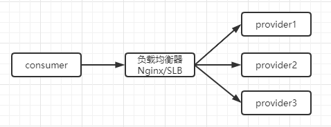
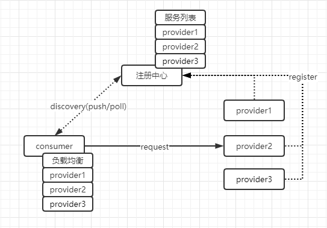

# 微服务升级导致调用超时异常的分析和方案

前几天，在做线上`异常日志巡检`时，发现通过公司自研的`RPC框架`调用`订单服务`出现`connect timed out`异常，在此记录对该问题的排查和相应的解决思路，作为备忘。

前情提要：

> 1、基于自研`注册中心`的服务发现体系。
>
> 2、基于自研`RPC框架`的服务间通信。
>
> 3、通过阿里云云效的流水线将微服务部署到`K8S平台`。
>
> 4、`K8S平台`下的 `服务升级` 是采用 `滚动升级`  逐步替换的策略。
>
> 5、`服务升级` 包含 `服务下线`和`服务上线`两个动作。涉及到`服务的注册与发现`。
>
> 6、下文中的`负载均衡` 指 `集中式负载均衡` 和 `客户端负载均衡`。

通过分析异常日志，然后结合`云效流水线`的`发布历史记录`发现：

> 1、异常`connect timed out`的`目标IP`和`发布历史记录`中`POD`的IP是一致的。
>
> 2、异常日志的时间点和发布历史记录中pod的下线时间点是基本一致的。
>
> 3、与`订单服务`的负责人确认异常时间点确实有做服务升级。

由此得出结论，该异常是因为服务升级所引起的。**那么为什么在服务升级时`RPC框架`没有及时将该`POD`从可用服务列表中剔除呢？**

经分析发现：`RPC框架`采用的是`定时轮询机制`去`注册中心`拉取服务列表，而定时就必然存在一个获取`时间差`。那么在这个`时间差`的范围内，`provider`进行升级`consumer`是不知道的，若此时刚好有请求通过`consumer`的`负载均衡`被路由到正在升级的`POD`上时，就会出现`connect timed out`的异常。

至此，根本的原因已找到，**究其本质它是一种一致性问题**。

> 如果`负载均衡`不能保证`强一致性`，那么为了`可用性`，`负载均衡`需要提供集群容错的能力。

为了加深理解和后续分析，下面对该超时异常场景举一个简单的例子：

> 假设订单服务有5个节点，分别标记为A、B、C、D、E。分两批滚动升级，第一批升级A和B，第二批升级C、D、E。
>
> 那么问题来了，当第一批节点升级时，这批节点是不可用的，若此时刚好有用户下单并且该下单请求被 `负载均衡`路由到这批升级的节点上时，会导致下单失败。

# 服务优雅升级的方案

**注意：节点的下线和上线，要通过某种通信方式通知 `负载均衡器`或`注册中心`。**

> 注：该方案仅为个人理解，若有错误或者更优的方案，欢迎留言一起探讨。

## 1、事前下线节点

> 在节点升级前通知 `负载均衡器`或`注册中心` 将节点给下线或剔除，保证`负载均衡`选择的节点始终都是可用的。

> 注：基于K8S平台的服务升级，POD是重新创建的，所以可以在旧POD关闭事件中发送请求给`负载均衡器`或`注册中心` 将节点给下线。当然也可以对云效流水线进行扩展来触发升级通知事件。

- **基于负载均衡器的节点下线**

通过某种方式动态修改 `负载均衡器` 的配置`剔除`节点，然后重新加载配置使修改生效。

> Nginx作为负载均衡器，则可以动态修改nginx的conf文件，将下线节点的`ip:port`从`upstream`配置中剔除掉，然后执行`nginx -s reload`重新加载配置。

- **基于注册中心的节点下线**

通过调用 `注册中心` 提供的API接口`剔除`节点。

## 2、事中集群容错

> 在节点无法连通时，由`负载均衡`提供`集群容错`的方案，提高应用的整体服务能力。
>
> 注：节点无法连通的情况：节点升级、宕机、跨机房网络问题等。

- **基于负载均衡器的容错**

可以通过提供健康检查机制自动屏蔽异常状态的节点来实现的。

- **基于注册中心的容错**

可以在`消费端`提供`集群容错`能力，当出现失败，重试其它服务器。

## 3、事后上线节点

> 在节点升级后将节点`ip:port`添加到 `负载均衡器`或`注册中心` 。

- **基于负载均衡器的节点上线**

通过某种方式动态修改 `负载均衡器` 的配置`添加`节点，然后重新加载配置使修改生效。

- **基于注册中心的节点上线**

通过调用 `注册中心` 提供的API接口`添加`节点。

# 负载均衡类型

`负载均衡` 分为两大类： `集中式负载均衡` 或 `客户端负载均衡`  。

## 1、集中式负载均衡

`集中式负载均衡`通俗的讲就是通过一个独立的程序来路由转发请求，一般称之为`负载均衡器`或`网关`。

> 如：硬负载（F5）、软负载（Nginx、阿里 `SLB` 等）

## 2、客户端负载均衡

在客户端组件中实现`负载均衡`逻辑，将请求通过`负载均衡算法`路由到某个服务。

> 【客户端服务列表来源】：客户端定时从`注册中心`拉取，或者由`注册中心`推送。

> 如：微服务体系 `Dubbo` 、`Spring Cloud` 都提供了客户端负载均衡实现。

# 集群容错方案

在`集群容错`方面可以借鉴`Dubbo`的实现，具体如下：

- Failover 

>  失败自动切换，当出现失败，重试其它服务器 。 通常用于读操作，但重试会带来更长延迟。 可设置重试次数。

- Failfast

>  快速失败，只发起一次调用，失败立即报错。 通常用于非幂等性的写操作，比如新增记录。 

- Failsafe 

>  失败安全，出现异常时，直接忽略。通常用于写入审计日志等操作。

- Failback 

>  失败自动恢复，后台记录失败请求，定时重发。通常用于消息通知操作。 

- Forking 

>  并行调用多个服务器，只要一个成功即返回。通常用于实时性要求较高的读操作，但需要浪费更多服务资源。 

- Broadcast 

>  广播调用所有提供者，逐个调用，任意一台报错则报错。通常用于通知所有提供者更新缓存或日志等本地资源信息。 

