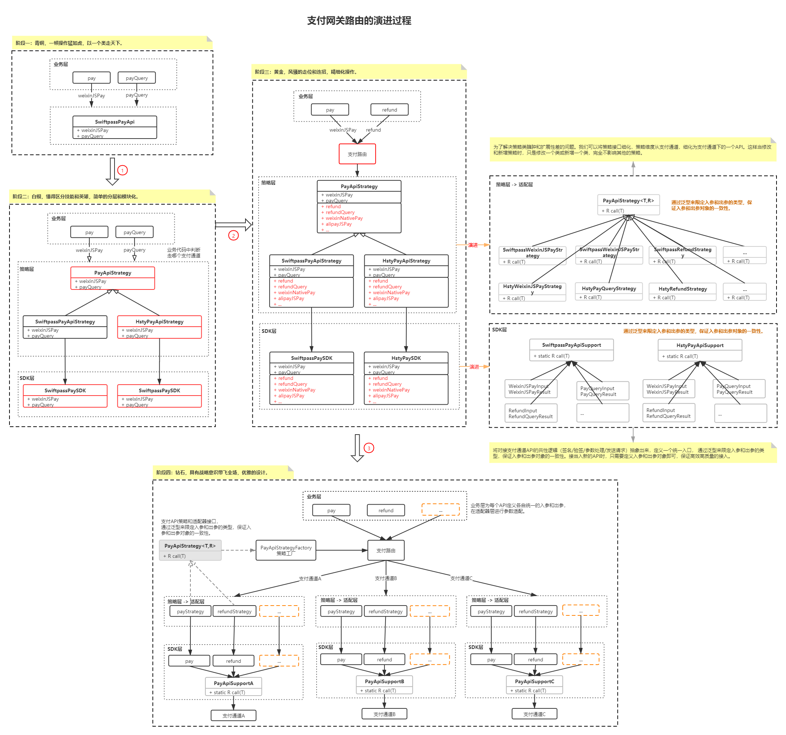
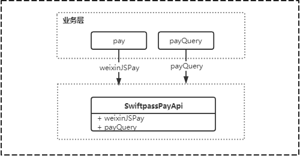
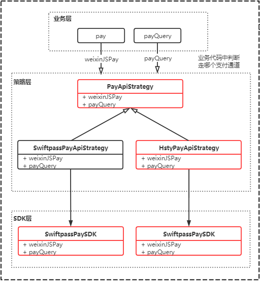
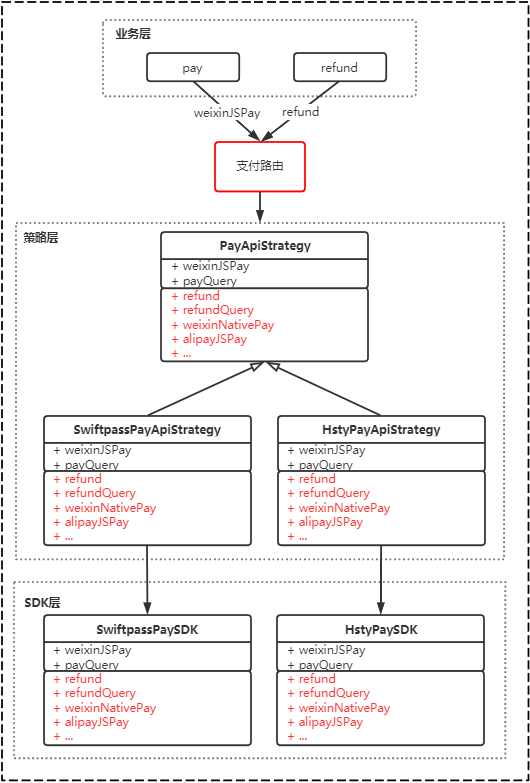
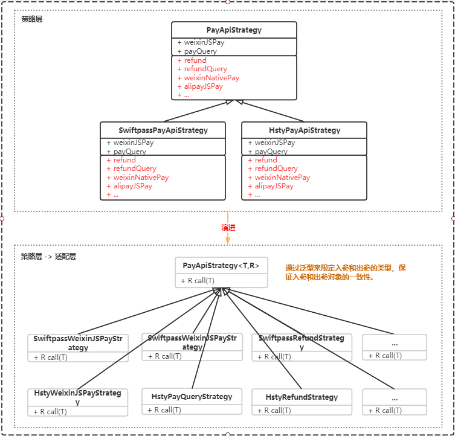
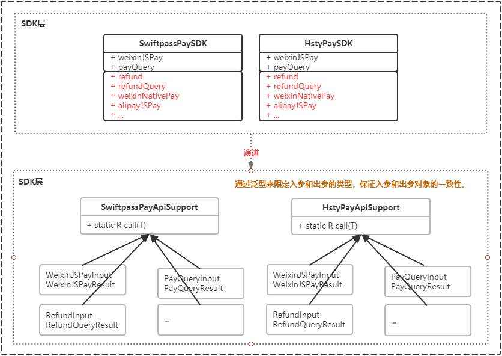
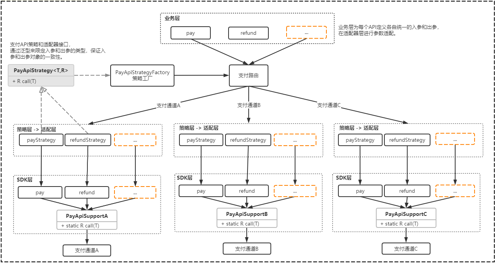

# 简介

本文的核心主题是关于`如何设计一个优雅的支付网关路由。` 
本文不仅仅来源于实战项目，后续还会将`支付网关路由`的核心逻辑从项目中剥离出来并实现开源，以供参考。

> 不同公司接入的第三方支付可能不一样，有的直连微信和支付宝，有的接入聚合支付通道，所以请将关注点重点放在设计方案这个层面，因为设计思想可以复用到别的场景，而代码则不一定适用。不仅要做一个会搬运代码的搬运工，还要做一个有灵魂的码农。

划重点，先上整体演进图：

下面将详细介绍随着业务的发展，是如何一步一步演进出最后的设计方案的，具体如下：

# 1、阶段一：青铜

**青铜，一顿操作猛如虎，以一个类走天下。**

业务刚开始时只需接入一家支付通道，并且只需要对接最基本的支付API。

由于时间紧迫，所以在一个类来实现了所有的支付API。

- 优点：

> 开发简单；快速响应业务 。

- 缺点：

> 1、以一个类走天下，随着业务发展实现类会越来越臃肿；
>
> 2、业务逻辑和支付API的调用逻辑混合在一起，可扩展性差 。

# 2、阶段二：白银

**白银，懂得区分技能和英雄，简单的分层和模块化。**

系统上线一段时间后，根据业务需要接入第二家支付通道。

具体实现：抽象出支付API的策略接口，不同支付通道在各自的策略实现类中实现相关逻辑；同时将不同支付通道的签名、验签、参数处理等共性逻辑分别剥离出来，暂且称为SDK层。 

- 优点：

> 实现分层和模块化，代码结构层次分明。

- 缺点：

> 增加新的支付通道后，在业务代码中需要显示判断走哪一个支付通道，而且是针对每一个支付API都需要判断，共性的逻辑散落在业务代码中，开发和维护都很麻烦。

# 3、阶段三：黄金

**黄金，风骚的走位和连招，精细化操作。**

随着业务的发展，需要适应更多的需求场景，比如退款、支付宝JS支付、扫码支付等。

具体实现：基于阶段二的实现，将业务层中判断支付通道的逻辑剥离出来，暂且称为支付路由；在`策略接口`和`SDK实现类`中增加新API的方法实现；

- 优点：

> 1、增加支付路由，便于后续扩展。

- 缺点：

> 1、`策略实现类`和`SDK实现类` 随着业务发展会越来越臃肿，可扩展性差；
>
> 2、新增方法会导致所有`策略实现类`必须实现新方法，容易引入未知的问题。
>
> 不管增加的支付API是所有支付通道共性的接口，还是某个支付通道特有的接口，都会导致所有的策略实现类去实现该支付API，哪怕是空实现。

- `策略层`优化思路：

为了解决`策略类`臃肿和扩展性差的问题，**我们可以将策略接口细化，策略维度从支付通道，细化为支付通道下的一个API。** 这样当修改和新增策略时，只是修改一个类或新增一个类，完全不影响其他的策略。

- `SDK层`优化思路：

与`策略层`优化思路一样，**我们也可以将`SDK实现类`细化， 将对接支付通道API的共性逻辑（签名/验签/参数处理/发送请求）抽象出来，定义一个统一入口， 通过泛型来限定入参和出参的类型，保证入参和出参对象的一致性。接当入新的API时，只需要定义入参和出参对象即可，保证高效高质量的接入。** 

# 4、阶段四：钻石

**钻石，具有战略意识带飞全场，优雅的设计。**

 随着业务发展，设计方案也在不断的进化，最终进化出来下图相对优雅的设计方案。 

- 优点：

> 1、易扩展性，易维护。
>
> 2、高内聚，低耦合：按模块化、分层等方式，将不同领域的功能点分离。
>
> 3、单一职责原则：每个策略类都只做自己的事情。
>
> 4、开闭原则：增加或者修改某一个API，完全不会影响其他支付通道，同时增加了迭代的可靠性。
>
> 5、快速接入：可快速接入新的支付通道，到达快速响应业务的目的。

- 缺点：

> 1、实现相对复杂，如果一开始就采用该方案未免有过度设计的嫌疑。
>
> 2、随着业务发展，策略类数量膨胀的情况，但是相对一个大而全的类膨胀，个人更加愿意选择类数量膨胀。

注：本方案中`适配器类`和`支付通道API` 的映射关系是通过`自定义注解` 来进行关联的，这种方式不支持动态维护支付通道配置。如果想要实现动态维护可以将关系存储在数据库。

# 总结

随着业务的发展，实现方案也在不断的进化，最终进化出来这样一个相对优雅的支付网关的设计方案。

从最终的设计方案中，可以发现里面包含了多种设计原则和设计模式。下面列举几种：

> **设计模式**
>
> 1、门面模式 - 支付API的统一调用入口。
>
> 2、策略模式 - 每一个支付API都作为一个策略。
>
> 3、适配器模式 - 在策略类中完成业务层统一参数和支付API参数的适配。
>
> 4、工厂模式 - 创建适配器的工厂。
>
> 5、单例模式 - HashMap容器维护适配器。

> **设计原则**
>
> 1、开闭原则 - 如策略类和SDK API的实现。
>
> 2、单一职责原则 - 如策略类和SDK API的实现。
>
> 3、低耦合原则 - 如策略类和SDK API的实现。
>
> 4、隐藏实现细节 - 如统一调用入口、支付路由等。
>
> 5、关注点分离 - 如支付路由、策略层、SDK层、等。
>
> 另外， `泛型` 和 `自定义注解` 的应用，很好的体现程序设计时`抽象思维`的重要性。

其实在设计之处并没有说一定要使用哪种设计模式，而是在设计出方案后，回过头梳理时，才发现某个点的实现符合某些设计原则和设计模式而已。

所以平时一定要多积累，对于常用的设计原则和设计模式要做到心里有数，掌握了设计思想和理念，才能设计出更加优雅完备的方案。另外，设计时不要为了设计而设计，一定要结合当前业务发展程度和具体问题来进行设计。当然如果你有类似场景的成功案例，那么完全可以参照搬过去，站在巨人的肩膀上，何乐而不为呢。

这套方案对于我个人而言，优雅的说法是一个思维模型的体现，一般的说法是掌握了一个`套路`，针对大多数的多业务场景，都可以`触类旁通`，也就是所谓的`一招鲜，吃遍天`。

